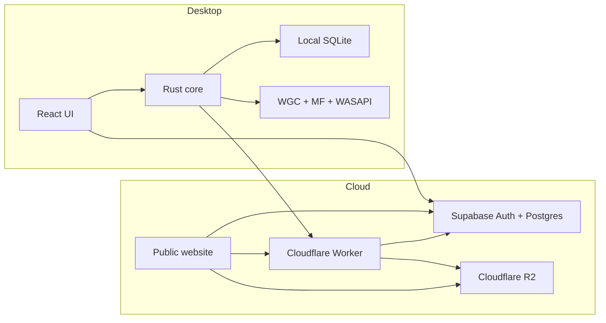
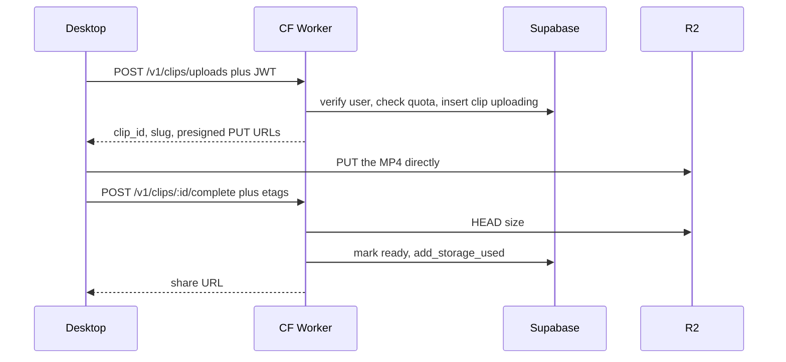

# Project Replay

Windows desktop gameplay clipper. Temporary product name; identifier `tv.elite.replay`.

It is a **native Tauri 2 app**, not a website in a wrapper. You capture locally, keep a library on this PC, then optionally upload a cloud copy while signed in. A separate website in `web/` shows the product, lets you manage cloud clips in a browser, and plays shared `/c/{slug}` links.

The locked design lives in [docs/ARCHITECTURE.md](docs/ARCHITECTURE.md). This README is the operator’s map: what exists, how the pieces talk, and how to run it.

## Current status

Phases 1–5 are done. Phase 6 (cloud upload) is in progress and usable locally.

| Phase | What it covers | Status |
| --- | --- | --- |
| 1 | Desktop shell, tray, settings, SQLite, email/password auth, onboarding | Done |
| 2 | Process watch and detected-game UI | Done |
| 3 | Windows Graphics Capture + Media Foundation + WASAPI → local MP4 | Done |
| 4 | Instant Replay buffer, Save Clip / screenshot hotkeys, disk-space guard | Done |
| 5 | Local library: player, thumbs, favorite / rename / delete | Done |
| 6 | Worker + R2 direct upload, quota, owner cloud library | In progress |
| 7 | Public clip URLs, web player, visibility, browser library | In progress |
| 8 | Social: likes, comments, follows, Explore | Not started |
| 9 | Encoder quality / overhead work | Not started |

**Live in the app today:** Home, Library (This PC + Cloud), Record, Settings, Account. Close-to-tray, Start/Stop recording, Instant Replay, and Save Clip all work from the tray. Explore and Friends are routed but off the nav rail until Phase 8.

## How the product is split

Treat these as separate systems. The React UI never records, encodes, or retries uploads. It calls Tauri commands and renders state.



| Layer | Role |
| --- | --- |
| React + Vite | Shell, library, account, settings. Uses the Supabase **anon** key only. |
| Rust / Tauri | Tray, hotkeys, filesystem, SQLite, capture, encode, remux, upload to R2. |
| SQLite | Local clips, settings, game catalog, upload queue. No auth tokens. |
| Supabase Auth | Email/password. Session JWT is the identity for cloud. |
| Supabase Postgres | Profiles, games catalog, clip metadata, storage quota. No video bytes. |
| Cloudflare Worker | JWT, presigned PUT/GET, quota, share player at `/c/{slug}` |
| Public website (`web/`) | Landing, browser library, same-account sign-in. Separate from the desktop UI. |
| Cloudflare R2 | The actual MP4 files. Keys look like `clips/{user_id}/{clip_id}/original.mp4`. |

Desktop `.env` may only contain:

- `VITE_SUPABASE_URL`
- `VITE_SUPABASE_ANON_KEY`
- `VITE_PUBLIC_APP_URL` (Worker origin for now; later the public site origin)

Never put `SUPABASE_SERVICE_ROLE_KEY` or R2 keys in the desktop app or any `VITE_` variable.

## Admin console

The operator console lives at `/admin` on the website. Admins also get a simpler Admin page in the desktop app. Both call `GET/PATCH/DELETE /v1/admin/*` with the signed-in JWT. The Worker accepts the request only when `app_metadata.role === "admin"` (never `user_metadata`). Privileged reads and writes use `SUPABASE_SERVICE_ROLE_KEY` on the Worker only.

Grant access in the Supabase SQL editor, then sign out and sign in again:

```sql
update auth.users
set raw_app_meta_data = coalesce(raw_app_meta_data, '{}'::jsonb) || '{"role":"admin"}'::jsonb
where email = 'you@example.com';
```

Unlisted clips can appear here for support. Copied share links stay `{origin}/c/{slug}`. Deletes are soft (`status = deleted`) plus R2 object removal. There is no mass wipe.

## Capture and Instant Replay

Pipeline:

```
Detected game window
  → Windows Graphics Capture
  → Media Foundation H.264 (Baseline, hardware MFT when available)
  → WASAPI audio
  → either a recording session file, or a ~2s segmented replay buffer
```

There is no FFmpeg sidecar. Shipping GPL FFmpeg would force the whole app under GPL; Media Foundation is the encoder.

**Game detection** runs in Rust. The catalog is data (`games.process_names`, wildcards allowed, e.g. `*GTAProcess.exe` for FiveM). The focused window wins if it is a catalog game; otherwise a running match is kept so alt-tabbing to Replay does not clear detection. Instant Replay does not start until a game is detected.

**Instant Replay** writes scratch segments into app cache (`replay-buffer`), not `Videos\Project Replay`. Those files are wiped when IR stops, the game closes, or IR is turned off. **Save Clip** remuxes the last N seconds (bitstream copy) into a library MP4 in the save folder. Default hotkeys:

| Action | Default |
| --- | --- |
| Save Clip | Ctrl+F10 |
| Start/Stop recording | Ctrl+F9 |
| Screenshot | Ctrl+F11 |

Manual **Start/Stop** writes a full session MP4. Screenshots are local BMP stills and are not uploaded.

Exclusive fullscreen can still miss Graphics Capture; borderless or windowed is reliable. DXGI Desktop Duplication remains the later fallback.

## Local library

Library is one page with two views. Local and cloud copies stay distinct.

- **This PC** — files in the save folder (default `Videos\Project Replay`), SQLite `local_clips`, in-app player, thumbs, favorite / rename / delete, Show in folder.
- **Cloud** — metadata for clips you uploaded, listed from Supabase under owner RLS.

A local clip can later point at a `cloud_clip_id`. Delete on the desktop app also deletes the cloud copy. Delete on the website deletes the cloud copy and removes the matching file from the Windows app the next time it opens. "Remove from cloud" on a local card only unlinks the upload and leaves the file on this PC.

## Accounts

Supabase Auth is the only auth system. Email + password. Passwords never sit on disk.

Sign-up / sign-in live on Account, Cloud (when signed out), and onboarding. Creating an account requires a real email and password (empty credentials were incorrectly treated as anonymous sign-in, which is disabled).

After a successful login, `supabase-js` persists the session through a Tauri command. The session JSON is **too large for Windows Credential Manager** (2560-byte cap), so it is stored as a DPAPI-protected file under app data. Passwords are still never stored.

`handle_new_user` creates a `profiles` row and a `user_storage` row (free plan quota) when an auth user is inserted. Usernames are 3–24 characters, `[a-zA-Z0-9_]`, unique case-insensitively. Clip URLs never include the username.

For local testing, turn **Confirm email** off in the Supabase dashboard so sign-up can sign in immediately. Leave **Anonymous** disabled.

Auth database connections must use **percentage allocation**, not a fixed cap. In the dashboard: **Authentication → Performance → Connection management → Allocation strategy → Percent of max connections**. Save about 10–20%. An absolute cap of 10 connections queues signups.

## Cloud upload (Phase 6)

Bytes never go Desktop → Worker → R2. The Worker only mints URLs and checks the result.



What happens in practice:

1. You are signed in. Save Clip (or click the cloud icon on a local MP4). Automatic upload defaults to **All clips** (Settings can set Off or Favorites only).
2. Rust asks `POST /v1/clips/uploads` on `VITE_PUBLIC_APP_URL` with the session JWT and file size.
3. The Worker checks the JWT, checks quota, creates an **unlisted** `clips` row, and returns PUT URLs. Object key is always `clips/{user_id}/{clip_id}/original.mp4` — the client cannot choose the path.
4. Files over 8 MB use multipart; smaller files use a single PUT. Upload goes straight to R2.
5. Rust calls `POST /v1/clips/:id/complete`. The Worker HEADs the object (native R2 binding if present, otherwise signed S3 HEAD), rejects empty objects, and calls `add_storage_used` so quota cannot be faked from the client.
6. Local row is marked `completed`. **Library → Cloud** lists owner clips. **Copy link** opens `{VITE_PUBLIC_APP_URL}/c/{slug}` on the Worker player.

The Worker uses the **user JWT** for clip and upload-session rows (RLS: owner only). `user_storage` is not writable through PostgREST; quota changes go through the `add_storage_used(p_bytes)` security-definer function, which uses `auth.uid()`.

Unlisted clips are watchable by anyone with the URL, but RLS will not list them to other users. Public listings stay `visibility = public AND status = ready` only. Slug playback uses `GET /v1/clips/:slug` plus `get_clip_for_playback`, not a PostgREST list.

Pause-uploads-while-gaming is a setting with no upload scheduler yet. Abandoned multipart cleanup (24h) is specified, not implemented.

## Website (browser)

The Windows app is unchanged. `web/` is a separate Vite React site that uses the same Supabase project and the Worker.

| URL | What it does |
| --- | --- |
| `http://127.0.0.1:5174/` | Homepage that sells the Windows app |
| `http://127.0.0.1:5174/features` | Instant Replay, local vs cloud, privacy |
| `http://127.0.0.1:5174/pricing` | Free / Pro / Pro+ from `plans` (Pro is coming soon) |
| `http://127.0.0.1:5174/creators` | Creator program; apply when signed in |
| `http://127.0.0.1:5174/signin` | Same email/password as the desktop |
| `http://127.0.0.1:5174/library` | Cloud clips: player, rename, visibility, copy link, delete |
| `http://127.0.0.1:5174/friends` | Unlisted share shortcuts; follows later |
| `http://127.0.0.1:5174/account` | Email, username, quota |
| `http://127.0.0.1:8787/c/{slug}` | Watch a shared cloud clip (desktop Copy link uses this) |

```bash
npm run worker:dev
npm run web:dev
```

Open `http://127.0.0.1:5174`. Vite proxies `/v1` to the Worker. Capture, tray, and the Tauri UI are not part of this process.

## Data

**Postgres (Supabase):** `plans`, `profiles`, `user_storage`, `games`, `clips`, `upload_sessions`, `creator_applications`. Video never goes in Postgres. Apply every file in `supabase/migrations/` in order.

**SQLite (desktop):** `settings`, `local_clips`, `upload_queue`, `games`. Migrations in `src-tauri/migrations/`.

## Required software

- Windows 10 or later
- [Node.js](https://nodejs.org/) 22+
- [Rust](https://rustup.rs/) stable (`x86_64-pc-windows-msvc`)
- [Visual Studio 2022 Build Tools](https://visualstudio.microsoft.com/visual-cpp-build-tools/) with **Desktop development with C++**
- WebView2 (usually already installed with Edge)
- Optional: [Supabase CLI](https://supabase.com/docs/guides/cli), [Wrangler](https://developers.cloudflare.com/workers/wrangler/) (pulled in via `worker/` npm deps)

`npm run tauri:dev` needs the MSVC environment (`vcvars64.bat`). Native Rust changes require a full Tauri restart; Vite HMR is not enough.

## Environment

Copy `.env.example` to `.env`.

**Desktop (safe to embed):**

| Variable | Purpose |
| --- | --- |
| `VITE_SUPABASE_URL` | Supabase project URL |
| `VITE_SUPABASE_ANON_KEY` | Anon / publishable key |
| `VITE_PUBLIC_APP_URL` | Worker origin. Local: `http://127.0.0.1:8787` |

**Worker / R2 (never `VITE_`):** keep in `.env.cloudflare` (gitignored):

- `R2_ACCESS_KEY_ID`
- `R2_SECRET_ACCESS_KEY`
- `R2_BUCKET_NAME`
- `R2_ENDPOINT` (used to derive `R2_ACCOUNT_ID`)

`npm run worker:dev` copies those plus the Supabase URL/anon key into `worker/.dev.vars` (also gitignored).

## Setup

1. Create a Supabase project. Enable Email auth. For desktop testing, turn off **Confirm email**. Leave Anonymous off.
2. Apply `supabase/migrations/` (SQL editor or `supabase db push`).
3. Put URL + anon key in `.env`. Set `VITE_PUBLIC_APP_URL=http://127.0.0.1:8787`.
4. Create an R2 bucket and API token. Put keys in `.env.cloudflare`.
5. `npm install` at the repo root, then `npm install` in `worker/` and `web/` if those folders have not been installed yet.

## Commands

Three terminals for desktop + cloud + website:

```bash
npm run worker:dev
npm run web:dev
npm run tauri:dev
```

Other commands:

```bash
npm install
npm run web:dev
npm run typecheck
npm run tauri:build
```

Rust tests (SQLite, detection, usernames, DPAPI session roundtrip):

```bash
cd src-tauri
cargo test
```

Worker health check: `http://127.0.0.1:8787/v1/health` should return `{"ok":true,"storage":true}`.

## Directory layout

```
src/                   React desktop UI
src-tauri/             Rust / Tauri core
src-tauri/migrations   SQLite
supabase/migrations    Postgres / RLS
worker/                Upload API + share player (Wrangler)
web/                   Public website (landing, library, player)
docs/ARCHITECTURE.md   Locked system design
```

## What is not done yet

- Rich OG tags and a production deploy of the website
- Cloud clip playback inside the desktop app
- Cloud delete / unlink
- Resume of interrupted multipart after restart
- 24h abandoned-upload cleanup
- Pause uploads while gaming
- Social, Explore, Friends (Phase 8)
- DXGI exclusive-fullscreen fallback

## Security rules to keep

- Desktop never ships service-role or R2 secrets
- Client cannot choose R2 paths
- Never trust client-reported size or MIME as final; Worker verifies with HEAD
- Unlisted clips must never appear in public PostgREST listings
- Clip URLs never include the username
- Auth tokens stay out of SQLite and `.env`
