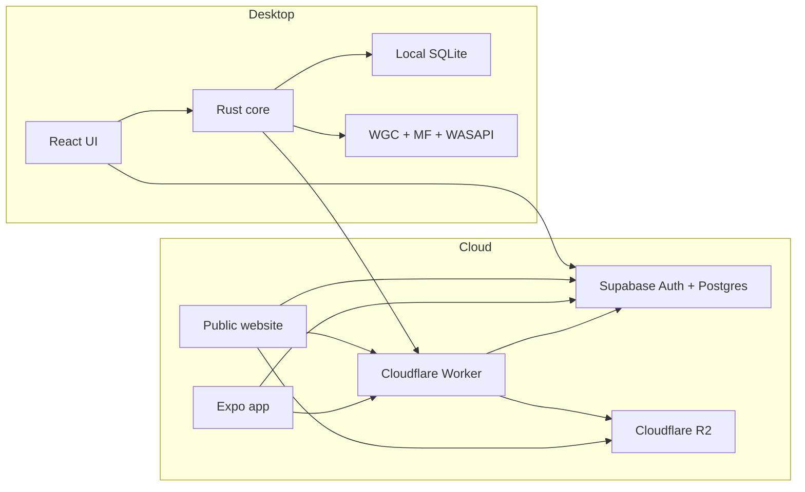
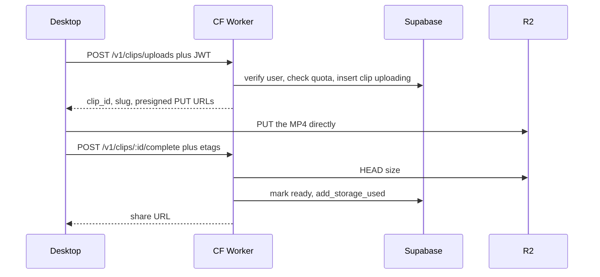

# Replayr

Windows gameplay clipper. Identifier `tv.elite.replay`. Site: [www.replayr.tv](https://www.replayr.tv).

It is a **native Tauri 2 app**, not a website in a wrapper. You capture on Windows, keep a library on this PC, then optionally upload a cloud copy while signed in. The website (`web/`) and mobile app (`mobile/`) are the cloud library and share player. They do not record.

The locked design lives in [docs/ARCHITECTURE.md](docs/ARCHITECTURE.md). Audio routing decisions live in [docs/AUDIO_ROUTING.md](docs/AUDIO_ROUTING.md). This README is the operator and developer map.

## Hard rules (read these first)

These are easy to break and expensive to undo.

- **Desktop is the clipper.** Do not merge `web/` into Tauri or rebuild capture on mobile.
- **Video path:** Desktop → R2. The Worker only mints URLs and verifies the object. Share links are `{origin}/c/{slug}` — never put a username in the URL.
- **Client env only:** `VITE_SUPABASE_URL`, `VITE_SUPABASE_ANON_KEY`, `VITE_PUBLIC_APP_URL` (and `EXPO_PUBLIC_*` on mobile). Never put the service-role key or R2 keys in the desktop, website, or mobile app.
- **Admin** is `app_metadata.role === "admin"`, never `user_metadata`.
- **Unlisted clips** are watchable with the link. They must never appear in public listings, Explore, or For You.
- **No GPL FFmpeg sidecar.** Encode with Media Foundation.
- **Do not start audio Step 2** (process-isolated Game audio) until someone confirms Step 1 clips sound right. Step 1 is one mixed AAC track (system loopback + optional mic).

## How the product is split

Treat these as separate systems. The React UI never records, encodes, or retries uploads. It calls Tauri commands and renders state.



| Layer | Role |
| --- | --- |
| React + Vite (`src/`) | Shell, library, Explore, account, settings. Supabase **anon** key only. |
| Rust / Tauri (`src-tauri/`) | Tray, hotkeys, filesystem, SQLite, capture, encode, remux, upload to R2, updater. |
| SQLite | Local clips, settings, game catalog, upload queue. No auth tokens. |
| Supabase Auth | Email/password (plus social on web/mobile). Session JWT is cloud identity. |
| Supabase Postgres | Profiles, games, clip metadata, likes/comments, quota. No video bytes. |
| Cloudflare Worker | JWT, presigned PUT/GET, quota, likes/comments, `/c/{slug}` player, static site + `latest.json`. |
| Website (`web/`) | Marketing, browser library, Explore, same-account sign-in, Windows download. |
| Mobile (`mobile/`) | Expo cloud library and player. No capture. |
| Cloudflare R2 | MP4s. Keys: `clips/{user_id}/{clip_id}/original.mp4`. |

Production Worker origin is `https://www.replayr.tv`. Local desktop `.env` should point `VITE_PUBLIC_APP_URL` at `http://127.0.0.1:8787`.

## Current status

The product is usable end to end: capture, local library, cloud upload, public/unlisted share links, likes/comments on **public** clips, in-app Windows updates.

| Area | Status |
| --- | --- |
| Desktop shell, tray, settings, SQLite, auth, onboarding | Done |
| Game detection | Done (catalog from cloud + local SQLite) |
| WGC + Media Foundation + WASAPI → local MP4 | Done |
| Instant Replay, Save Clip, session record, screenshot | Done |
| Local library (player, thumbs, favorite / rename / delete) | Done |
| Cloud upload to R2, quota, owner library | Done |
| Public `/c/{slug}` player, visibility, website library | Done |
| Likes and comments on public ready clips | Done |
| Explore / For You (public clips only) | Done |
| In-app updates (`latest.json` + signed `Replayr.exe`) | Done |
| Mic mixed into the one AAC track (Step 1) | Done — do not start Step 2 yet |
| Follows, notifications, isolated Game/Discord tracks | Not started |
| DXGI exclusive-fullscreen fallback | Not started |

**Desktop nav:** Home, Library, Explore, Games, Record, Friends, Settings, Account, Admin (admins only). The rail is fixed; only the page scrolls.

## Capture and Instant Replay

```
Detected game window
  → Windows Graphics Capture
  → Media Foundation H.264 (hardware MFT when available)
  → WASAPI (default-device loopback + optional mic)
  → session MP4, or a short segmented replay buffer
```

**Game detection** runs in Rust. The catalog is data (`games.process_names`, wildcards allowed). The focused window wins if it is a catalog game; otherwise a running match is kept so alt-tabbing to Replayr does not clear detection. Instant Replay starts when a game is detected.

**Instant Replay** writes scratch segments into app cache (`replay-buffer`), not the Videos folder. Those files are wiped when IR stops, the game closes, or IR is turned off. **Save Clip** remuxes the last N seconds (bitstream copy) into a library MP4.

| Action | Default |
| --- | --- |
| Save Clip | Ctrl+F10 |
| Start/Stop recording | Ctrl+F9 |
| Screenshot | Ctrl+F11 |

Manual Start/Stop writes a full session MP4. Screenshots are local BMP stills and are not uploaded.

Exclusive fullscreen can miss Graphics Capture; borderless or windowed is reliable.

### Audio (Step 1)

Settings → Audio: system loopback on/off, one microphone (on/off, device, gain, meter). New installs leave the mic **off** until the user opts in. Live mic changes apply without rewriting the Instant Replay buffer.

The mic meter can open the device for level only. It does **not** mix into clips unless Microphone is on.

Do not run WASAPI open, Media Foundation, or `sync_replay` on the Tauri UI thread. Those hang the splash (“Starting Replayr…”) and freeze settings. Capture and audio apply on background threads.

## Local and cloud library

Library is one page with two views. Local and cloud copies stay distinct.

- **This PC** — files in the save folder (default Videos), SQLite `local_clips`, in-app player, thumbs, favorite / rename / delete.
- **Cloud** — owner clips from the API. A fresh install has an empty This PC list even if Cloud has clips from another machine.

A local clip can point at a `cloud_clip_id`. Delete on desktop also deletes the cloud copy. “Remove from cloud” unlinks the upload and leaves the file on this PC.

Automatic upload defaults to **All clips** (Settings: Off or Favorites only).

## Accounts

Supabase Auth is the only auth system. Desktop uses email + password. Web/mobile also use OAuth where configured.

After login, `supabase-js` persists the session through Tauri commands. The session JSON is **too large for Windows Credential Manager** (2560-byte cap), so it is a DPAPI-protected file under app data. Keyring is migration-only and must not fail sign-in. Passwords are never stored.

`handle_new_user` creates `profiles` and `user_storage` (free quota). Usernames are 3–24 characters, `[a-zA-Z0-9_]`, unique case-insensitively.

Onboarding is local SQLite (`onboardingCompleted`). A new portable install always looks like first run; if the signed-in profile already has a username, skip the username step.

For local testing, turn **Confirm email** off. Leave **Anonymous** disabled.

Auth database connections must use **percentage allocation** (about 10–20%), not a tiny fixed cap, or sign-up queues.

## Cloud upload

Bytes never go Desktop → Worker → R2. The Worker mints URLs and checks the result.



1. Signed-in Save Clip (or the cloud icon) asks `POST /v1/clips/uploads` with the JWT and file size.
2. The Worker checks quota, creates an **unlisted** `clips` row, and returns PUT URLs. The client cannot choose the R2 key.
3. Files over 8 MB use multipart. Upload goes straight to R2.
4. `POST /v1/clips/:id/complete` HEADs the object, rejects empty files, and calls `add_storage_used`.
5. **Copy link** is `{origin}/c/{slug}`.

Social (like / comment) is only for `visibility=public` and `status=ready`. Unlisted stays watchable, not listed.

## Website and mobile

| URL | What it does |
| --- | --- |
| `https://www.replayr.tv/` | Product site and Windows download |
| `/explore` | Public For You feed |
| `/library` | Signed-in cloud clips |
| `/c/{slug}` | Share player |
| `/admin` | Operator console |
| `/releases/Replayr.exe` | Current Windows download |
| `/releases/latest.json` | Updater manifest (must be JSON, never the SPA shell) |

```bash
npm run worker:dev
npm run web:dev
```

Local site: `http://127.0.0.1:5174`. Worker: `http://127.0.0.1:8787`. Vite proxies `/v1` to the Worker.

Mobile: `npm run mobile:start` (Expo). Same three public env values with the `EXPO_PUBLIC_` prefix.

## Admin

`/admin` on the website; desktop has a simpler Admin page. Both call `/v1/admin/*` with the JWT. The Worker accepts the request only when `app_metadata.role === "admin"`. Privileged writes use `SUPABASE_SERVICE_ROLE_KEY` on the Worker only.

```sql
update auth.users
set raw_app_meta_data = coalesce(raw_app_meta_data, '{}'::jsonb) || '{"role":"admin"}'::jsonb
where email = 'you@example.com';
```

Sign out and sign in again after granting admin. Unlisted clips can appear here for support. Deletes are soft (`status = deleted`) plus R2 removal.

## Desktop internals developers hit

### Tauri commands and ACL

Tauri 2 denies any app command that is not allowed. Custom permissions live in `src-tauri/permissions/`. `src-tauri/capabilities/default.json` must include `allow-app-commands` plus the audio / auth / shortcut allows. If you add a new `#[tauri::command]`, add it to `permissions/app.toml` (or the matching file) **and** `lib.rs` `generate_handler!`. Missing ACL looks like `list_local_clips not allowed` / command not found, empty Library, and “Game detection failed to start.”

### Do not block the UI thread

`set_setting` must not restart Instant Replay on the IPC thread. Only capture-related keys call `sync_replay`, and that runs on a background thread. Setup must not call `sync_replay` on the main thread either — that freezes “Starting Replayr…”.

The splash waits for settings + auth, then fail-opens after 2.5s so a hung invoke cannot pin the window forever.

### `tauri:dev` vs installed build

`npm run tauri:dev` needs the MSVC environment (`vcvars64.bat`). Native Rust changes need a full Tauri restart; Vite HMR is enough for React-only work.

In-app updates **do not run** in `tauri:dev`. Test updates from a downloaded `Replayr.exe` install.

PowerShell often breaks `vcvars` paths that contain `(x86)`. Use `cmd.exe`:

```bat
"C:\Program Files (x86)\Microsoft Visual Studio\2022\BuildTools\VC\Auxiliary\Build\vcvars64.bat" && npm run tauri:dev
```

## Windows download and updates

Public download: **[Replayr.exe](https://www.replayr.tv/releases/Replayr.exe)** (NSIS current-user, no wizard). `src-tauri/windows/nsis-hooks.nsh` forces a silent extract, skips auto shortcuts, and launches the app. Desktop shortcuts are created from onboarding / Settings.

In-app updates read `https://www.replayr.tv/releases/latest.json`. Settings → Updates: check, then **Restart to update**. The nav Settings icon badges when an update is ready.

This path is **working**. `latest.json` is a signed Tauri updater manifest. If that URL ever returns the website HTML, the app shows `error decoding response body`. The Worker serves `/releases/latest.json` first and rejects non-JSON so the SPA fallback cannot impersonate the manifest.

### Signing keys

The **private** key is `.tauri/updater.key` (gitignored, no password). The matching **public** key is `plugins.updater.pubkey` in `src-tauri/tauri.conf.json`.

```bash
npx @tauri-apps/cli signer generate --ci -w .tauri/updater.key
```

Paste `.tauri/updater.key.pub` into `pubkey`. Never commit the private key. If it is lost, existing installs cannot verify new updates.

`TAURI_SIGNING_PRIVATE_KEY` is the **key contents**. `TAURI_SIGNING_PRIVATE_KEY_PATH` is the **file path**. `tauri build` often still fails to see the path env on this machine; sign the NSIS setup after the bundle exists.

### Ship an update

1. Bump `version` in `package.json`, `src-tauri/tauri.conf.json`, and `src-tauri/Cargo.toml` (all three).
2. Build the NSIS bundle (MSVC env required):

```bat
"C:\Program Files (x86)\Microsoft Visual Studio\2022\BuildTools\VC\Auxiliary\Build\vcvars64.bat" && npm run tauri:build
```

3. Sign the new setup (empty password is `--password=` with nothing after `=`):

```powershell
npx @tauri-apps/cli signer sign --private-key-path .tauri/updater.key --password= -- path\to\Replayr_x.y.z_x64-setup.exe
```

4. Stage and deploy:

```bash
npm run installer:stage
npm run web:deploy
```

`installer:stage` copies the setup whose filename contains the **current** `tauri.conf.json` version to `web/public/releases/Replayr.exe` and writes `latest.json` from that file’s `.sig`. It searches `src-tauri/target` and the Cursor cargo sandbox cache. It **fails** if the signature is missing — never invent one. The signature must be of the exact bytes that will be at `https://www.replayr.tv/releases/Replayr.exe`.

`web/public/releases/*.exe`, `*.sig`, and `latest.json` are gitignored. Deploy uploads whatever is in `web/dist/releases/` after the website build.

Installed builds older than the live `latest.json` version should show the update in Settings. `tauri:dev` will not.

## Required software

- Windows 10 or later
- [Node.js](https://nodejs.org/) 22+
- [Rust](https://rustup.rs/) stable (`x86_64-pc-windows-msvc`)
- [Visual Studio 2022 Build Tools](https://visualstudio.microsoft.com/visual-cpp-build-tools/) with **Desktop development with C++**
- WebView2 (usually already installed with Edge)

## Environment

Copy `.env.example` to `.env`.

**Desktop (safe to embed):**

| Variable | Purpose |
| --- | --- |
| `VITE_SUPABASE_URL` | Supabase project URL |
| `VITE_SUPABASE_ANON_KEY` | Anon / publishable key |
| `VITE_PUBLIC_APP_URL` | Worker origin. Local: `http://127.0.0.1:8787`. Production builds that talk to live cloud: `https://www.replayr.tv` |

**Mobile (`mobile/.env`):**

| Variable | Purpose |
| --- | --- |
| `EXPO_PUBLIC_SUPABASE_URL` | Same Supabase project URL |
| `EXPO_PUBLIC_SUPABASE_ANON_KEY` | Anon / publishable key |
| `EXPO_PUBLIC_APP_URL` | Production: `https://www.replayr.tv` |

**Worker / R2 (never `VITE_`):** `.env.cloudflare` (gitignored) → `npm run worker:dev` copies into `worker/.dev.vars`.

## Setup

1. Create a Supabase project. Enable Email auth. For desktop testing, turn off **Confirm email**. Leave Anonymous off.
2. Apply `supabase/migrations/` (SQL editor or `supabase db push`).
3. Put URL + anon key in `.env`. Set `VITE_PUBLIC_APP_URL=http://127.0.0.1:8787`.
4. Create an R2 bucket and API token. Put keys in `.env.cloudflare`.
5. `npm install` at the repo root, then `npm install` in `worker/`, `web/`, and `mobile/` as needed.

## Commands

Three terminals for desktop + cloud + website:

```bash
npm run worker:dev
npm run web:dev
npm run tauri:dev
```

| Command | What it does |
| --- | --- |
| `npm run tauri:dev` | Desktop with Vite. Needs `vcvars64`. |
| `npm run tauri:build` | Release NSIS installer. |
| `npm run installer:stage` | `Replayr.exe` + `latest.json` from the matching `.sig`. |
| `npm run web:deploy` | Build `web/` and deploy the Worker + assets (production `PUBLIC_APP_URL`). |
| `npm run typecheck` | Desktop TypeScript. |
| `npm run mobile:start` | Expo. |

```bash
cd src-tauri
cargo test
```

Worker health: `http://127.0.0.1:8787/v1/health` → `{"ok":true,"storage":true}`.

## Data

**Postgres:** `plans`, `profiles`, `user_storage`, `games`, `clips`, `upload_sessions`, `creator_applications`, `clip_likes`, `clip_comments`. Video never goes in Postgres. Apply every file in `supabase/migrations/` in order. Likes/comments have RLS enabled and **no client policies** — Worker service-role only. Triggers keep `clips.like_count` / `comment_count`.

**SQLite (desktop):** `settings`, `local_clips`, `upload_queue`, `games`. Migrations in `src-tauri/migrations/`.

## Directory layout

```
src/                   React desktop UI
src-tauri/             Rust / Tauri core
src-tauri/migrations   SQLite
src-tauri/permissions  Tauri ACL (add new commands here)
supabase/migrations    Postgres / RLS
worker/                API + share player + production static assets
web/                   Public website
web/public/releases    Staged Replayr.exe + latest.json (gitignored binaries)
mobile/                Expo cloud app (no capture)
scripts/               installer:stage
.tauri/                updater private key (gitignored)
docs/ARCHITECTURE.md   Locked system design
docs/AUDIO_ROUTING.md  Audio plan (Step 1 shipped)
```

## What is not done yet

- Isolated Game / Discord / app audio (Mode 1) and separate tracks
- DXGI exclusive-fullscreen fallback
- Resume of interrupted multipart after restart
- 24h abandoned-upload cleanup
- Pause uploads while gaming
- Follows and notifications
- Rich OG tags on every share page

## Security rules to keep

- Desktop never ships service-role or R2 secrets
- Client cannot choose R2 paths
- Never trust client-reported size or MIME as final; Worker verifies with HEAD
- Unlisted clips must never appear in public PostgREST listings or Explore
- Clip URLs never include the username
- Auth tokens stay out of SQLite and `.env`
- Never commit `.tauri/updater.key` or invent an updater signature
