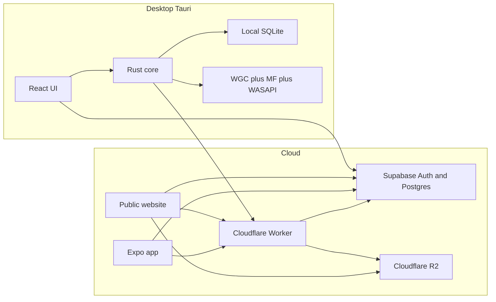
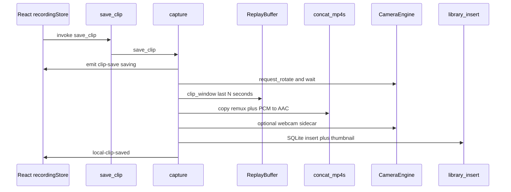
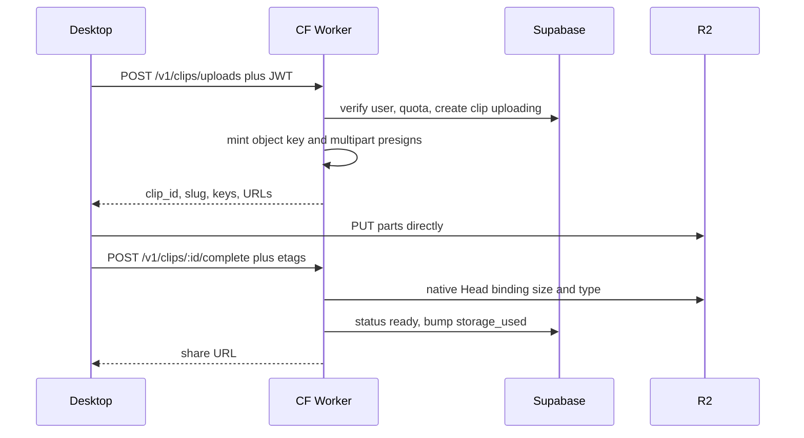

# Replayr — Architecture

Display name **Replayr**. Identifier `tv.elite.replay`.  
Branding constants live in `src/branding.ts` and `src-tauri/src/branding.rs`.

This document is the current-system source of truth. Operator commands, env, and ship steps live in [README.md](../README.md). Audio routing details live in [AUDIO_ROUTING.md](./AUDIO_ROUTING.md). Admin metric names live in [analytics-metrics.md](./analytics-metrics.md).

## Contents

1. [Product](#product)
2. [Hard constraints](#hard-constraints)
3. [Systems](#systems)
4. [How to read the repo](#how-to-read-the-repo)
5. [Technology stack](#technology-stack)
6. [How the pieces interact](#how-the-pieces-interact)
7. [Instant Replay](#instant-replay)
8. [Recording](#recording)
9. [Preview](#preview)
10. [Game detection](#game-detection)
11. [Webcam](#webcam)
12. [Audio](#audio)
13. [Local library](#local-library)
14. [Cloud upload](#cloud-upload)
15. [Share URLs](#share-urls)
16. [Following and social](#following-and-social)
17. [Folders](#folders)
18. [Billing](#billing)
19. [Announcements and notifications](#announcements-and-notifications)
20. [Authentication](#authentication)
21. [Database](#database)
22. [Local SQLite](#local-sqlite-desktop)
23. [Desktop UX](#desktop-ux)
24. [Remaining work](#remaining-work)
25. [History](#history)

## Product

A native **Tauri 2** gameplay clipper: Instant Replay, hotkey clips, session recording, local library, optional cloud copy, shareable URLs, folders, following, DMs, and Explore.

It is **not** a web app in a browser wrapper.

| Surface | Role |
| --- | --- |
| Windows desktop | Capture, encode, remux, local library, then optional upload while signed in |
| macOS desktop (Apple Silicon) | Same signed-in shell: cloud library, folders, Following, messages, Explore. **No capture** |
| Website (`web/`) | Marketing, signed-in cloud library, Explore, `/c/{slug}` player, `/f/{token}` folders, OAuth handoff, downloads |
| Mobile (`mobile/`) | Expo cloud library, folders, and player. **No capture** |

Capture does not happen in the browser or on mobile.

## Hard constraints

These are expensive to undo. Do not violate them in a “quick fix.”

- **Desktop is the clipper.** Do not merge `web/` into Tauri or rebuild capture on mobile.
- **Capture stays on Windows.** Mac packaging is `tauri:build:macos` / `.github/workflows/macos-dmg.yml` only. Do not retarget `npm run tauri:build` (NSIS).
- **Video path:** Desktop → R2. The Worker mints URLs and verifies the object. Never Desktop → Worker → R2 for bytes.
- **Share links** are `{origin}/c/{slug}`. Never put a username in a clip URL.
- **Client env only:** `VITE_SUPABASE_URL`, `VITE_SUPABASE_ANON_KEY`, `VITE_PUBLIC_APP_URL` (and `EXPO_PUBLIC_*` on mobile). Never ship the service-role key or R2 keys in a client.
- **Admin** is `app_metadata.role === "admin"`, never `user_metadata`.
- **Unlisted clips** are watchable with the link. They must never appear in public listings, Explore, or For You.
- **No GPL FFmpeg sidecar.** Encode with Windows Media Foundation (hardware MFT when available).
- The React UI never contains recording, encoding, or upload-retry logic. It calls Tauri commands and renders state.

## Systems

Treat these as separate systems with stable interfaces.

1. Gameplay capture (WGC)
2. Video encoding (Media Foundation)
3. Local replay buffer
4. Session / composed recording
5. Local clip library
6. Upload management
7. Cloud object storage (Cloudflare R2)
8. Application database (Supabase PostgreSQL)
9. Social graph (follows, blocks, DMs, likes, comments)
10. Folders and public folder links
11. Public clip viewer
12. Billing (Stripe)



## How to read the repo

| Path | Role |
| --- | --- |
| `src/` | React desktop UI (Vite, HashRouter) |
| `src-tauri/` | Rust / Tauri core: capture, encode, SQLite, upload, tray, hotkeys |
| `src-tauri/migrations/` | Desktop SQLite schema |
| `src-tauri/permissions/` | Tauri ACL — new `#[tauri::command]` must be listed here **and** in `lib.rs` `generate_handler!` |
| `worker/` | Cloudflare Worker: `/v1/*` API, share players, site assets, `latest.json` |
| `web/` | Public website (Vite). Production is served by the Worker |
| `mobile/` | Expo cloud app |
| `supabase/migrations/` | Postgres schema, RLS, RPCs |
| `packages/social-types/` | Shared follow / folder / relationship types |
| `docs/` | This file, audio routing, analytics dictionary, release notes |
| `.tauri/` | Updater private key (gitignored) |

Desktop Zustand stores live in `src/stores/`. Typed Tauri wrappers live in `src/services/tauri.ts`. Worker HTTP wrappers live in `src/services/api.*.ts` (web and mobile have twins).

## Technology stack

| Layer | Choice |
| --- | --- |
| Desktop shell | Tauri 2, identifier `tv.elite.replay` |
| UI | React, TypeScript, Vite |
| Native | Rust |
| Local data | SQLite with numbered migrations |
| Auth + metadata | Supabase Auth + PostgreSQL + RLS |
| Privileged API | Cloudflare Workers |
| Video bytes | Cloudflare R2 |
| Public site | Separate Vite app in `web/` |
| Mobile | Expo (`mobile/`) |
| Payments | Stripe via the Worker |

Desktop / web / mobile may hold only:

- `VITE_SUPABASE_URL` / `EXPO_PUBLIC_SUPABASE_URL`
- `VITE_SUPABASE_ANON_KEY` / `EXPO_PUBLIC_SUPABASE_ANON_KEY`
- `VITE_PUBLIC_APP_URL` / `EXPO_PUBLIC_APP_URL`

Never ship:

- `SUPABASE_SERVICE_ROLE_KEY`
- `R2_SECRET_ACCESS_KEY`
- `R2_ACCESS_KEY_ID`

## How the pieces interact

1. **React** renders the desktop shell. It uses `@supabase/supabase-js` with the anon key. Supabase Auth is the authentication authority.
2. **Tauri/Rust** owns tray, autostart, hotkeys, filesystem, SQLite, capture, encode, remux, and upload-to-R2. UI talks to Rust only through typed commands and events.
3. **SQLite** is the desktop source of truth for local clips, settings, the game catalog cache, and the upload queue. Auth secrets are not stored in SQLite or localStorage.
4. **Supabase Auth** issues JWTs. The session blob is a DPAPI-protected file under app data (Windows Credential Manager cannot hold a JWT session — the cap is 2560 bytes). `supabase-js` still performs sign-in, refresh, and sign-out.
5. **Cloudflare Worker** verifies the JWT, then uses the service role only on the server for privileged rows (create clip, quota, unlisted slug lookup, social writes, delete).
6. **R2** stores bytes. Postgres stores object keys such as `clips/{user_id}/{clip_id}/original.mp4`.
7. **Public web** is a separate Vite app for marketing, cloud clip management, and playback. The Expo app is the same cloud product on iOS/Android.

## Instant Replay

Windows only. Instant Replay is **not** “Start Recording.” It is always-on rolling capture while `instantReplayEnabled` is true and a catalog game is detected.

`sync_replay()` starts and stops it. Call sites: the 2s game-detection poll, app startup (background thread), capture-related settings, tray. **Never** run `sync_replay`, WASAPI open, or Media Foundation on the Tauri UI / IPC thread — that hangs the window.

### Target lock

Once IR starts, `ir_target.rs` locks the **PID**. Alt-tab and detection changes do not retarget capture. Window selection: largest valid window for that PID → that window’s monitor → primary monitor.

When the process exits: stop capture and **discard** scratch segments.

Sticky detection (keep the last catalog match for one empty poll so alt-tabbing to Replayr does not clear the Home UI) is separate from this lock.

### Buffer

`ReplayBuffer` in `buffer.rs` is a ring of **~2 second** independently decodable MP4 segments (`SEGMENT_HNS = 20_000_000` hundred-nanoseconds).

Scratch lives in **app cache** `{app_cache}/replay-buffer/`, not the user save folder. Files are wiped when IR stops, the game closes, or IR is turned off. A legacy `{save}/.replay-buffer` path is purged if found.

Each segment records path, duration, size, fps, `start_hns` / `end_hns`, `pinned` (manual recording), and `locked` (in-flight save). The ring prunes from the front when retained duration exceeds `replayDurationSeconds` (default 60), unless pinned or locked.

### Encode path

```
Detected game window
  → Windows Graphics Capture
  → EncodePump thread (replay-encode)
  → Media Foundation H.264 (hardware MFT when available)
  → seg-NNNNNN.mp4 + optional PCM sidecar
  → ReplayBuffer.push
```

DXGI Desktop Duplication is the documented fallback for exclusive fullscreen; **it is not implemented**. Borderless or windowed is reliable.

### Save Clip

Default hotkey **Ctrl+F10** (`CommandOrControl+F10`). Same entry point from Record UI, tray, and global hotkey.



Disk output: `{saveLocation}/clip-{timestamp}.mp4`, optionally `{same}-webcam.mp4`. Default save folder is `{Videos}/Project Replay`.

### Bitrate

IR and Save Clip use `resolve_clip_bitrate()` in `recording_bitrate.rs` (High is a higher 1080p60 anchor than composed recording). Changing bitrate while IR is running restarts capture and **clears the buffer**, unless segments are pinned or locked by an unfinished save. The UI listens for `replay-bitrate-applied`.

### Key files

| Path | Role |
| --- | --- |
| `src-tauri/src/capture.rs` | WGC session, `sync_replay`, save clip, legacy record |
| `src-tauri/src/buffer.rs` | Segment ring, clip/session windows |
| `src-tauri/src/encode_pump.rs` | Encode thread, 2s rotation |
| `src-tauri/src/encode.rs` | Media Foundation H.264 / AAC writer |
| `src-tauri/src/ir_target.rs` | PID lock |
| `src-tauri/src/ir_runtime.rs` | Encoder diagnostics, bitrate restart rules |
| `src-tauri/src/export/remux.rs` | Segment concat + AAC stitch |
| `src-tauri/src/hotkeys.rs` | Global shortcuts |
| `src/stores/recordingStore.ts` | UI state and events |

## Recording

Two output modes on the Record page (`scene.outputMode`).

### Legacy

Uses the same WGC + EncodePump path as Instant Replay.

- **Warm start** (IR already rolling): set `session=true`, pin buffer segments with `begin_session()`. No capture restart.
- **Cold start** (no IR): open a new WGC session. If IR is enabled, segments still go to the ring and are pinned.
- **Stop:** concat the pinned session window into one MP4, optional webcam sidecar, insert into the library. If IR remains enabled, the ring keeps rolling; otherwise capture halts and scratch is discarded.

Webcam is **not** burned into the gameplay file. It is a parallel `{file}-webcam.mp4` sidecar on a shared `SessionClock`.

### Composed

GPU compositor in `src-tauri/src/recording_compositor/`. Burns the Record layout (capture + webcam / image / text + Replayr overlay) into **one** MP4.

Composed recording requires Instant Replay **off** and no active WGC IR session.

```
RecordingComposition JSON
  → validate in scene.rs
  → ComposedCapture (game or display WGC) + optional webcam
  → D3D11 VideoProcessor canvas (NV12)
  → ordered sources, filters, HUD
  → GPU H.264 + in-session AAC
  → single library MP4
```

Crop is UV then contain/cover. Dest `transform` is placement only. Frontend preview must match Rust (`src/recording/composedSemantics.ts`).

Bitrate uses `resolve_recording_bitrate()` (lower 1080p60 Medium anchor than IR clips).

### Scenes and the Record UI

Scenes and sources live in the frontend (`src/recording/scene.ts`, `sceneLibrary.ts`, localStorage). `snapshotRecordingComposition()` in `composition.ts` is the IPC payload.

Record layout: **sources | preview | inspector**, splitter, then dock **mixer | record controls**, status flush at the bottom. Double-click a source in the source bar to rename it in place (`SourceNameEdit.tsx`). Inspector still edits the selected source.

Output framing uses **contain**, not cover.

### Key files

| Path | Role |
| --- | --- |
| `src/pages/RecordPage.tsx` | Record route |
| `src/components/recording/RecordWorkspace.tsx` | Studio layout, dock splitter |
| `src/recording/scene.ts` | Scene / source model |
| `src/recording/composition.ts` | Scene → Rust composition |
| `src-tauri/src/recording_compositor/` | Composed session, GPU composite, encode |
| `src-tauri/src/commands.rs` | `start_recording` / `start_composed_recording` / `save_clip` |

## Preview

Observational only. Preview failure must not stop capture (`src-tauri/src/preview/mod.rs`).

Priority of taps:

1. Composed tap during composed recording
2. WGC tap during IR / legacy capture
3. Standalone WGC when idle (UI-retained preview)

`PreviewHub` scales BGRA → JPEG → base64. The Record canvas (`RecordingPreview.tsx`) composites CSS layers independently of the encode path.

## Game detection

Process watch runs in Rust (`detection.rs`). The React UI only renders snapshots and catalog data.

- Local SQLite `games` is the desktop catalog (`slug`, `process_names` JSON, optional `cloud_id`)
- `process_names` is **data**. Detection matches running Windows image names; it does not hardcode titles. Entries may include `*` wildcards (for example `*GTAProcess.exe`)
- Prefer the focused window when it belongs to a catalog game; otherwise keep a running catalog match
- **Sticky:** if a poll finds nothing, keep the previous snapshot for **one** empty poll (~2s) so alt-tabbing to Replayr does not clear Home
- When online, the desktop may refresh the catalog from Supabase `games` (public read)
- Instant Replay starts from this snapshot, then **locks PID** separately (`ir_target.rs`)

Events: `detected-game` → `src/stores/detectionStore.ts`. Side effects: tray tooltip, Discord presence, `sync_replay`.

## Webcam

Optional. Gameplay capture never depends on it. Lives in `src-tauri/src/camera/`.

| Phase | Module | Behavior |
| --- | --- | --- |
| Device enum | `device.rs`, `engine.rs` | Media Foundation enumeration |
| Settings / Record preview | `preview.rs` | Live frames for UI |
| IR rolling | `roll.rs` | 2s H.264 segments on shared `SessionClock` |
| Buffer | `ring.rs` | Same ring semantics as gameplay |
| Export | `engine.save_overlap_sidecar()` | `{clip}-webcam.mp4` |
| Compose on upload / editor | `export/webcam/` | Timeline-follow overlay burn-in for cloud |

IR webcam uses Settings → Webcam. Session recordings can use the scene transform. `overlay.rs` owns corner / custom layout math.

## Audio

Instant Replay, legacy recording, and composed recording share **one audio engine** and one mixed AAC track.

Current mix (Milestone A / Step 1):

- Game Audio via process loopback of the detected game’s PIDs when isolation works (`process_loopback.rs`)
- Optional desktop / system loopback
- Optional microphone (off until the user opts in; disconnect does not auto-switch devices)

Live mic / gain / mute changes apply without rewriting the Instant Replay buffer.

**Not shipped:** separate MP4 audio tracks, Mode 2 (desktop mix with exclusions), extra isolated app sources as their own tracks. Do not fake isolated tracks.

The full contract is [AUDIO_ROUTING.md](./AUDIO_ROUTING.md). Clock: capture timestamps, encode thread owns Media Foundation, PCM sidecars on segmented IR, AAC once at remux.

## Local library

Library is one page with three views. Local and cloud copies stay distinct.

- **This PC** — files in the save folder, SQLite `local_clips`, in-app player, thumbs, favorite / rename / delete
- **Cloud** — owner clips from the Worker. A fresh install has an empty This PC list even if Cloud has clips from another machine
- **Folders** — shared collections (same folders on desktop, web, and mobile)

A local clip can point at a `cloud_clip_id`. Delete on desktop also deletes the cloud copy. “Remove from cloud” unlinks the upload and leaves the file on this PC.

Default save location: `{Videos}/Project Replay` (Documents fallback). Screenshots are local BMP stills and are **not** uploaded.

Automatic upload defaults to **All clips** (Settings: Off or Favorites only). `cloudUploadWhen` can wait until the user leaves the game (`afterGame`).

Thumbs are generated at local export (`library.rs`).

## Cloud upload

Bytes never go Desktop → Worker → R2.



Rules:

- Worker generates `clips/{user_id}/{clip_id}/original.mp4` — the client cannot choose paths
- Reject if `storage_used + verified_size > storage_limit`
- Never trust client size/MIME as final; verify with native R2 HEAD
- Multipart for large files (object ceiling 8 GB); persist `upload_queue` in SQLite
- Cleanup: uploads not completed within 24h are aborted, objects deleted, clip marked failed/deleted, quota not charged
- If a `-webcam.mp4` sidecar exists, `upload.rs` may compose it onto the gameplay file before PUT
- Default upload visibility: **unlisted**
- Cloud play: `GET /v1/clips/:slug` with JWT returns a signed URL; CORS includes `https://tauri.localhost` (Windows) and `tauri://localhost` (Mac)

Server-side object ops (HEAD, delete, cleanup) use **native R2 bindings**. S3 SigV4 is **only** for short-lived client PUT/GET URLs.

## Share URLs

Canonical public clip URL:

```
https://{PUBLIC_APP_URL}/c/{slug}
```

Profile:

```
https://{PUBLIC_APP_URL}/u/{username}
```

Public folder:

```
https://{PUBLIC_APP_URL}/f/{token}
```

Clip URLs **never** include the username. Changing a username must not break old shares.

- Slugs are random, unique, and stable for the life of the clip
- Default Quick Share / cloud upload visibility: **unlisted**
- Unlisted is watchable by anyone with the URL and must **never** appear in public listings, feeds, searches, or profile clip lists
- Private: owner, plus DM grants via `conversation_clips`
- Public: Explore, search, profile lists
- Likes and comments exist only for `visibility=public` and `status=ready`

### Unlisted vs PostgREST

An RLS policy of `visibility IN ('public', 'unlisted')` would let anyone `SELECT` every unlisted clip.

**Decision:** RLS allows listing/selecting **public + ready** clips and **owner** clips only. Unlisted and private reads go through the Worker `GET /v1/clips/:slug` (service role, one row, no listing).

## Following and social

The graph is **follows**, not a separate friends table for new writes.

| Concept | Meaning |
| --- | --- |
| `follows` | `follower_id` → `following_id`, status `pending` or `accepted` |
| Public profile | Follow auto-accepts |
| Private profile (`profiles.is_private`) | Follow creates `pending`; profile body stays locked until accepted |
| **Friends** (legacy API / relationship `friends`) | **Mutual accepted follows** |
| Nav label | **Following** (route still `/friends`) |
| Blocks | `blocks` table; block clears follows |
| DMs | Require **mutual follow** (`requireMutualFollow`) |

`friendships` still exists in Postgres; `/v1/friends/*` routes delegate to follows (`worker/src/social.ts` → `worker/src/follows.ts`).

Worker (canonical):

| Method | Path | Behavior |
| --- | --- | --- |
| POST | `/v1/users/:username/follow` | Follow or request |
| DELETE | `/v1/users/:username/follow` | Unfollow |
| GET | `/v1/following` / `/v1/followers` | Lists |
| GET | `/v1/follows/requests` | Incoming / outgoing pending |
| POST | `/v1/follow-requests/:username/accept` | Accept |
| POST / DELETE | `/v1/users/:username/block` | Block / unblock |

Desktop client: `src/services/api.follows.ts`, `src/pages/FriendsPage.tsx`, `src/pages/UserProfilePage.tsx`. Shared types: `packages/social-types`.

Relationship enum: `none | outgoing | incoming | friends | following | follower | blocked`.

### Messages, Explore, posts

- Conversations: DM or group; members; messages may attach a `clip_id` (`conversation_clips` grants playback)
- Realtime: `messages` and `notifications` in the Supabase publication; unread badges via `socialUnreadStore`
- Explore / For You: **public + ready** clips only (`GET /v1/clips/public`). Friends feed is public clips from mutual follows
- Profile posts: `posts` table; Worker `GET/POST /v1/posts`
- User search / suggestions: `/v1/users/search`, `/v1/users/suggestions`
- Writes go through the Worker (service role). Clients get SELECT-only RLS where Realtime needs it

## Folders

Shared collections, same IDs on desktop, web, and mobile.

- `folders`, `folder_clips`, `folder_members` (manager | editor | viewer), `folder_invites`
- Public link: hashed token, URL `/f/{token}` (`folder_public_secrets` is service-role only)
- Collaborative non-destructive edits: `folder_clip_edits`
- Activity feed: `folder_activity`

Desktop: `src/stores/folderStore.ts`, `src/services/api.folders.ts`. Worker modules: `folders.ts`, `folderCollab.ts`, `folderPublic.ts`, `folderEdits.ts`, `folderActivity.ts`.

## Billing

Stripe via the Worker (`worker/src/billing.ts`).

| Plan | Typical effect |
| --- | --- |
| Free | ~5 GB, duration/quality caps, watermark on upload/download, ads |
| Premium (`pro` / `pro_plus` or grant) | Higher quota, no watermark, no ads, original quality |

`GET /v1/billing/status`, Checkout, Customer Portal, Stripe webhook → `apply_user_plan()`. Upload gate `assertUploadAllowed()` enforces duration / resolution / fps.

Do not put Stripe secrets in any Vite bundle.

## Announcements and notifications

**Notifications** table kinds include follow request/accept, message, group invite, folder invite/role/ownership. `GET /v1/notifications`, `POST /v1/notifications/read`. Worker inserts on social/folder events; clients also subscribe to Realtime INSERTs.

**Announcements** are service-role only. `GET /v1/announcements?surface=desktop|web|mobile`. Admin CRUD is `/v1/admin/announcements`. Local dismiss key: `replayr.announcements.v1`.

## Authentication

Supabase Auth only.

- Email + password
- Google, Discord, and X (Twitter) where enabled in the Supabase project
- Desktop OAuth opens the **system browser** with `redirectTo` `https://www.replayr.tv/auth/desktop`. That page must stay reachable **without** the coming-soon cookie. It hands the PKCE `code` to `replayr://auth-callback`
- Session persistence: DPAPI-protected file under app data. Keyring is migration-only
- Passwords are never stored locally
- `handle_new_user` creates `profiles` and `user_storage` (free quota)
- Usernames: 3–24 characters, `[a-zA-Z0-9_]`, unique case-insensitively
- Worker validates JWT via `GET {SUPABASE_URL}/auth/v1/user`

Allowlist in Supabase: `https://www.replayr.tv/auth/desktop` and `https://www.replayr.tv/auth/callback`.

## Database

UUID primary keys. Video bytes never go in PostgreSQL. Counters are denormalized (triggers or Worker), not `COUNT(*)` on feeds.

Core tables: `plans`, `profiles`, `user_storage`, `games`, `clips`, `upload_sessions`, `follows`, `blocks`, `conversations` / `messages` / `conversation_clips`, `clip_likes`, `clip_comments`, `posts`, `notifications`, folders + collab, `billing_*`, `announcements`, waitlist, analytics events / daily aggregates.

### Visibility and status

Visibility: `public` | `unlisted` | `private`  
Status: `uploading` | `processing` | `ready` | `failed` | `deleted`

### Indexes (still required)

- `clips (user_id, created_at DESC)` — owner library
- `clips (game_id, created_at DESC)` — game feeds
- Partial `clips (published_at DESC) WHERE visibility = 'public' AND status = 'ready'` — Explore; keeps unlisted out
- `clips (slug)` unique
- `profiles (username_normalized)` unique
- `games USING GIN (process_names)`
- `upload_sessions (expires_at)`

Apply every file in `supabase/migrations/` in order.

## Local SQLite (desktop)

Path: `{app_data_dir}/replay.sqlite` (WAL).

- `settings`
- `local_clips`
- `upload_queue`
- `games`

Numbered SQL migrations in `src-tauri/migrations`. Auth tokens are not stored here.

## Desktop UX

- Dark, compact, native chrome (`decorations: false`, custom title bar)
- Fixed left nav; only the page scrolls
- **Nav:** Home, Library, Explore, Games, Record, Following, Messages, Settings, Profile, Admin (admins only)
- Library tabs: This PC / Cloud / Folders
- HashRouter with `useTransitions={false}` so leaving Record is not raced by preview frames
- Close-to-tray is default
- Overlay window (`overlay.html`) shows “Clip saved” near the game monitor; not injected into the game
- Mac Record is in the rail; capture commands return “Recording is only available on Windows”

Onboarding is local SQLite (`onboardingCompleted`). The window **opens immediately**; settings and auth init in the background (fail-open). Do not block that path with capture work.

## Remaining work

Shipped end to end on Windows: IR, Save Clip, session record (legacy + composed), local library, cloud upload, folders, following, DMs, public/unlisted shares, likes/comments on public clips, billing, in-app Windows updates, Mac cloud shell.

Not started or incomplete:

- Isolated Discord / extra-app audio sources and **separate MP4 audio tracks** (see AUDIO_ROUTING Mode 1 / Step 2)
- Mode 2 desktop mix with exclusions
- DXGI exclusive-fullscreen fallback
- Resume of interrupted multipart after a desktop restart (queue exists; restart resume is incomplete)
- Apple Sign-In on desktop
- Intel Mac DMG and Apple notarization
- Recording / Instant Replay on macOS

## History

Early delivery was planned as numbered phases (shell → detection → capture → IR → library → Worker/R2 → public player → social). Those phases are **done** except the remaining-work items above. Do not use the old phase table as a live roadmap.
