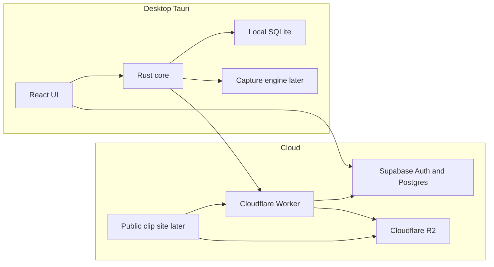
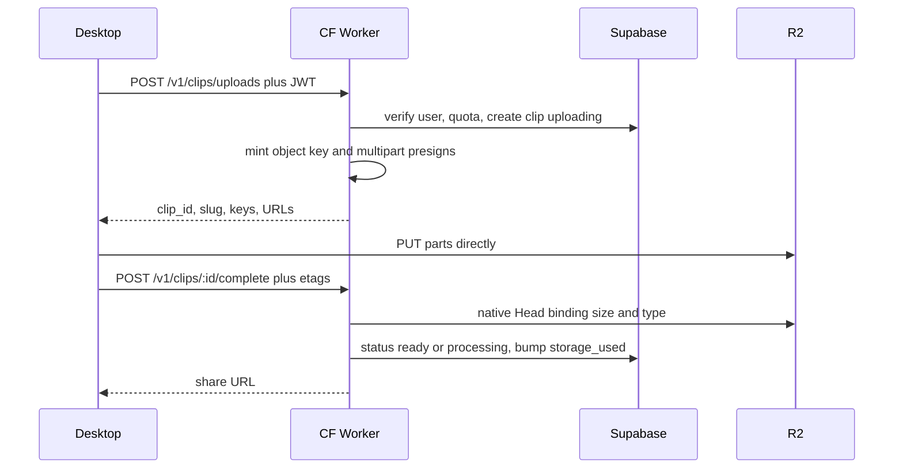

# Project Replay — Architecture

Temporary product name: **Project Replay**.  
Application identifier: `tv.elite.replay`  
Display name, domain, and support address live in centralized branding constants (`src/branding.ts` and `src-tauri/src/branding.rs`) so they can change without a rewrite.

This document is the approved architecture. Later phases must follow it.

## Product

A native Windows desktop gameplay clipping application: instant replay, hotkey clips, local library, cloud storage, shareable URLs, and later social features.

It is **not** a web app in a browser wrapper. The primary product is a Tauri desktop application. The public website in `web/` is marketing, signed-in cloud account pages (library, friends shell, account), and the `/c/{slug}` player. Capture does not happen in the browser.

## Systems

Treat these as separate systems with stable interfaces. Do not tightly couple them.

1. Gameplay capture
2. Video encoding
3. Local replay buffer
4. Local clip library
5. Upload management
6. Cloud object storage (Cloudflare R2)
7. Application database (Supabase PostgreSQL)
8. Social network (later phases)
9. Public clip viewer (later phase)



The React UI never contains recording, encoding, or upload-retry logic. It calls Tauri commands and renders state.

## Technology stack

| Layer | Choice |
| --- | --- |
| Desktop shell | Tauri 2, identifier `tv.elite.replay` |
| UI | React, TypeScript, Vite |
| Native | Rust |
| Local data | SQLite with numbered migrations |
| Auth + metadata | Supabase Auth + PostgreSQL + RLS |
| Privileged API | Cloudflare Workers |
| Video bytes | Cloudflare R2 |
| Public site | Separate Vite app in `web/`: marketing, account, player — not the desktop UI |

Desktop client may hold only:

- `VITE_SUPABASE_URL`
- `VITE_SUPABASE_ANON_KEY`
- `VITE_PUBLIC_APP_URL`

Never ship:

- `SUPABASE_SERVICE_ROLE_KEY`
- `R2_SECRET_ACCESS_KEY`
- `R2_ACCESS_KEY_ID`

## How the pieces interact

1. **React** renders the desktop shell, settings, and auth UI. It uses `@supabase/supabase-js` with the anon key. Supabase Auth is the authentication authority. There is no custom auth system.
2. **Tauri/Rust** owns tray, autostart, hotkeys, filesystem, SQLite, and later capture/upload. UI talks to Rust only through typed commands and events.
3. **SQLite** is the desktop source of truth for local clips, settings, and the upload queue. Auth secrets are not stored in SQLite or localStorage.
4. **Supabase Auth** issues JWTs. The session blob is persisted as a DPAPI-protected file under app data (Windows Credential Manager cannot hold a JWT session — the cap is 2560 bytes). `supabase-js` still performs sign-in, refresh, and sign-out; only the storage backend is native.
5. **Cloudflare Worker** (Phase 6) verifies the Supabase JWT, then uses the service role only on the server for privileged rows (create clip, quota, unlisted slug lookup, delete).
6. **R2** stores bytes. Postgres stores object keys such as `clips/{user_id}/{clip_id}/original.mp4`.
7. **Public web** (Phase 7+) is a separate Vite app for marketing, cloud clip management, and playback. Clip URLs do not depend on usernames. The Expo app in `mobile/` is the same cloud product on iOS/Android. Capture does not happen there.

## Recording architecture (Phase 3+, not Phase 1)

Do not replace this with an FFmpeg child process and call recording complete.

Long-term pipeline:

```
Windows Graphics Capture
  → Media Foundation / hardware encoder
  → segmented replay buffer
```

DXGI Desktop Duplication is the fallback where exclusive fullscreen bypasses DWM.

Traits to implement later:

- `CaptureEngine` — start/stop, target window or monitor, frames on a non-UI thread
- `AudioCapture` — device selection, per-source gain, optional separate tracks. Advanced routing (process loopback, mixer, multi-track MP4): [AUDIO_ROUTING.md](./AUDIO_ROUTING.md).
- `VideoEncoder` — GPU textures in; `EncoderCapabilities { vendor, codec, avc, hevc, av1, max_resolution, hardware }`
- `ReplayBuffer` — ~2s independently decodable segments, ring by duration. Scratch files live in app cache, not the clip save folder, and are deleted unless Save Clip remuxes them into a library file.
- `RecordingSession` — manual start/stop to a single file
- `ClipExporter` — concatenate segments with copy/remux

Legal constraint: do not ship GPL FFmpeg as a sidecar unless the whole app is accepted as GPL. Prefer Windows Media Foundation hardware MFTs (NVENC/AMF/QSV) with a software fallback.

Phase 3 adds start/stop recording to a playable local MP4. Phase 4 adds Instant Replay, clip hotkeys, screenshots, and a disk-space guard.

## Game detection (Phase 2)

Process watch runs in the Rust core. The React UI only renders snapshots and catalog data.

- Local SQLite `games` is the desktop catalog (`slug`, `process_names` JSON, optional `cloud_id`)
- `process_names` stays **data**. Detection matches running Windows image names against the catalog; it does not hardcode titles. Entries may include `*` wildcards (for example `*GTAProcess.exe` for FiveM)
- Prefer the focused window when it belongs to a catalog game; otherwise keep a running catalog match so alt-tabbing to Replay does not clear detection
- The Home/Record UI and tray tooltip show the detected game. Capture starts in Phase 3
- When online, the desktop may refresh the catalog from Supabase `games` (public read)

## Cloudflare Worker and R2 (Phase 6)

Privileged video operations live in Cloudflare Workers, not Supabase Edge Functions.

### Server-side object operations — native R2 bindings

Use Workers R2 bindings for:

- HEAD / object metadata
- deletion
- cleanup
- existence checks
- other server-side object operations

### S3-compatible SigV4 — only for direct client uploads

Use the R2 S3 API and SigV4 **only** where the desktop client must upload directly with a short-lived presigned URL.

Desktop video bytes must go:

```
Desktop → R2
```

Never:

```
Desktop → Worker → R2
```



Rules:

- Worker generates `clips/{user_id}/{clip_id}/original.mp4` — the client cannot choose paths
- Reject if `storage_used + verified_size > storage_limit`
- Never trust client size/MIME as final; verify with native R2 HEAD
- Multipart for large files; persist `upload_queue` in SQLite and resume after restart
- Cleanup: uploads not completed within 24h are aborted, objects deleted, clip marked failed/deleted, quota not charged

## Share URLs

Canonical public URL:

```
https://{PUBLIC_APP_URL}/c/{slug}
```

Example: `https://replay.example/c/H7ks92L`

Profile URLs:

```
https://{PUBLIC_APP_URL}/u/{username}
```

Clip URLs **never** include the username. Changing a username must not break old shares.

- Slugs are random, unique, and stable for the life of the clip
- Default Quick Share / simple cloud upload visibility: **unlisted**
- Unlisted clips are watchable by anyone with the URL
- Unlisted clips must **never** appear in public listings, feeds, searches, or profile clip lists
- Private clips: owner only (specific-user sharing later)
- Public clips: Explore, search, profile lists

### Unlisted vs PostgREST

An RLS policy of `visibility IN ('public', 'unlisted')` would let anyone `SELECT` every unlisted clip.

**Decision:** RLS allows listing/selecting **public + ready** clips and **owner** clips only. Unlisted and private reads go through the Worker `GET /v1/clips/:slug` (service role, one row, no listing).

## Database

UUID primary keys. Video bytes never go in PostgreSQL. Counters are denormalized (triggers or Worker), not `COUNT(*)` on feeds.

### Phase 1 migrations (foundational)

- `plans` — storage/quality limits; no payments
- `profiles` — username, display name, avatar, bio, flags, denormalized counts
- `user_storage` — used/limit bytes, plan FK; writes via service role only
- `games` — slug, name, `process_names text[]` (data, not app logic)
- `clips` — metadata, slug, keys, visibility, status
- `upload_sessions` — in-flight multipart metadata and expiry

Social tables (`likes`, `comments`, `follows`, `notifications`, `clip_views`, `clip_shares`, `reports`, `blocked_users`) may exist in SQL to preserve schema design. Phase 1 must not build application logic around them.

### Visibility and status

Visibility: `public` | `unlisted` | `private`  
Status: `uploading` | `processing` | `ready` | `failed` | `deleted`

### Indexes

- `clips (user_id, created_at DESC)` — owner library
- `clips (game_id, created_at DESC)` — game feeds later
- `clips (status)` — processing/cleanup jobs
- Partial `clips (published_at DESC) WHERE visibility = 'public' AND status = 'ready'` — Explore; keeps unlisted out of the index
- `clips (slug)` unique — share lookup
- `profiles (username_normalized)` unique — case-insensitive usernames
- `games USING GIN (process_names)` — exe → game mapping
- `upload_sessions (expires_at)` — abandoned upload cleanup

## Local SQLite (desktop)

- `settings`
- `local_clips`
- `upload_queue`
- numbered SQL migrations in `src-tauri/migrations`

Auth tokens are not stored here.

## Desktop UX principles

- Dark, compact, native application chrome
- Left navigation rail
- Subtle borders and short hover transitions
- Strong keyboard focus
- Not a SaaS marketing dashboard
- Local vs cloud clip state must stay distinct once clips exist. Library is one page with This PC and Cloud views.

Primary pages: Home, Library, Record, Settings, Account. Explore and Friends remain routed but off the rail until Phase 8.

Close-to-tray is default. Tray Start/Stop recording, Instant Replay, and Save Clip are live.

## Authentication

- Supabase Auth only (email/password in Phase 1)
- Discord / Google / Steam later
- Session persistence: DPAPI-protected file under app data (Credential Manager is too small for a Supabase session)
- Passwords are never stored locally
- Users choose a unique username: 3–24 characters, letters/numbers/underscore, case-insensitive uniqueness
- Clip URLs do not depend on username

## Cost and security defaults

- No video or large binaries in Postgres
- Direct-to-R2 uploads
- Native R2 bindings for server object ops
- Abandoned upload cleanup at 24h
- Thumbnails generated at local clip export
- Pause uploads while gaming (later; default on)
- Never trust client-reported ownership, file size, MIME type, or storage paths
- Rate limits on Worker for upload authorization and slug lookups; client limits are UX only

## Phased delivery

Do not skip ahead. Do not start the next phase with a broken project.

| Phase | Scope |
| --- | --- |
| 1 | Desktop shell, tray, settings, SQLite, Supabase auth, profile, onboarding. **No recording.** |
| 2 | Game/process detection and Home detected-game UI |
| 3 | WGC capture, MF encoder, WASAPI, start/stop, playable local file |
| 4 | Segmented replay buffer, clip hotkey, disk-space guard |
| 5 | Local library, player, thumbs, favorite/rename/delete |
| 6 | Worker + R2 signed multipart, queue, retry, quota |
| 7 | Slugs, public player, OG, copy link, visibility |
| 8 | Profiles, likes, comments, follows, notifications, Explore |
| 9 | Hardware encoder quality, overhead benchmarks, buffer memory |

Phase 6–7 are in progress: signed-in Save Clip can upload Desktop → R2. The public site lives in `web/` and the Worker serves `/c/{slug}` playback.
