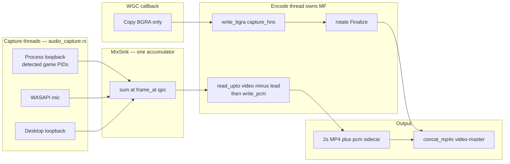
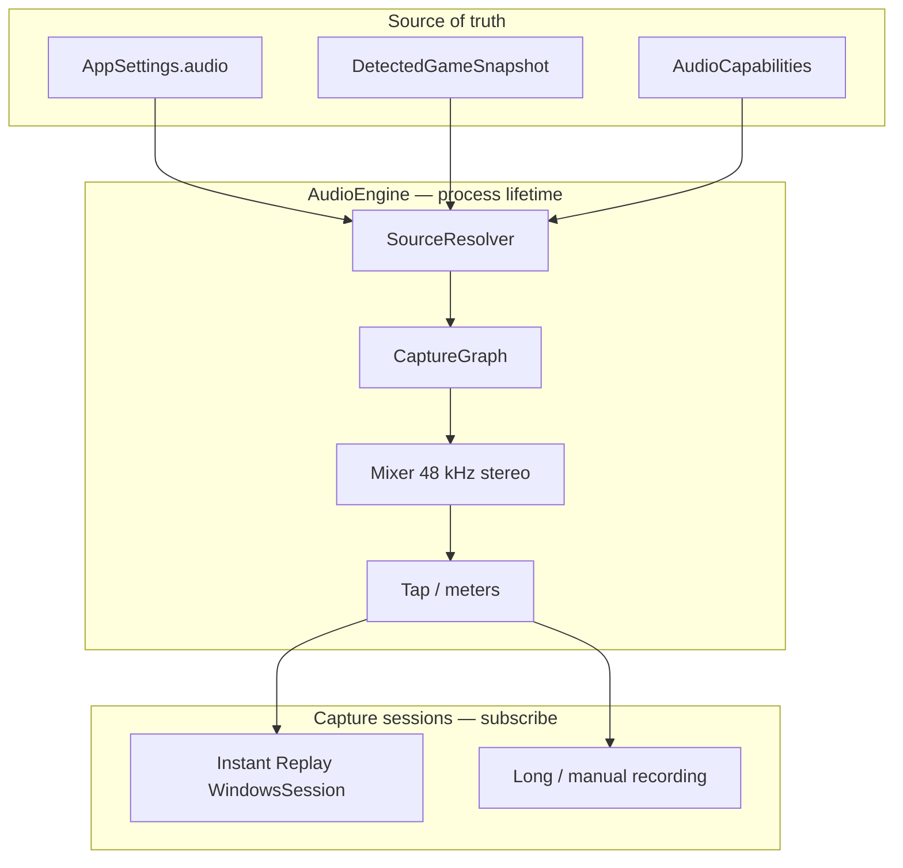
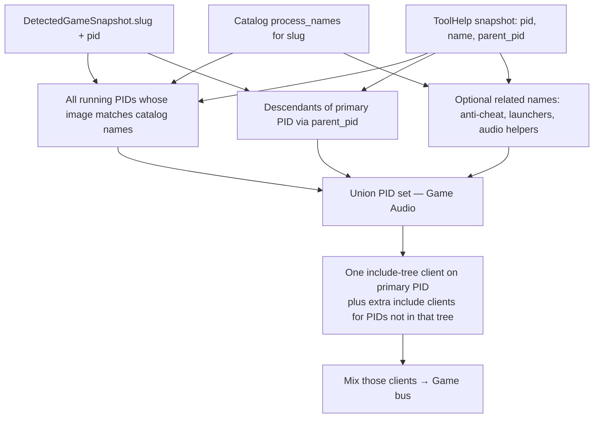
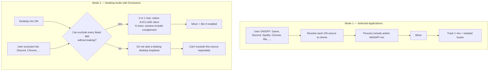
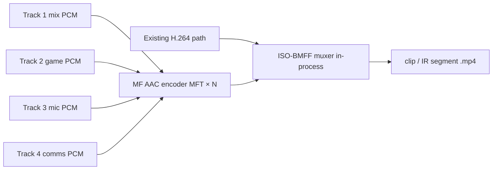

# Replayr Advanced Audio Capture and Routing

Status: **architecture plan** with approved shipping priorities (2026-08-23). Implementation is incremental; do not treat later milestones as blockers for the first honest mix.  
Owner surface: desktop Tauri core (`src-tauri`) + Settings / Onboarding / Record UI.  
Related locked doc: [ARCHITECTURE.md](./ARCHITECTURE.md) (gameplay capture, MF encoder, no GPL FFmpeg sidecar).

This plan is the source of truth for Instant Replay, long recording, and manual recording audio. All three consume one engine and one routing config.

### Approved shipping priorities

These override earlier “ship everything in V1” wording where they conflict. The rest of the architecture stays.

1. **Milestone A (first ship)** is correct real routing + **one mixed AAC track**. Multi-track MP4 must **not** block A. Separate Tracks remains the desired architecture. If the MF MPEG-4 sink cannot reliably write four audio tracks, ship mix-only first and move the non-GPL ISO-BMFF muxer to the **immediately following** milestone. **Never fake separate tracks.**
2. **Prioritize Mode 1 (Selected Applications).** Mode 2 Desktop+Exclusions comes after Game + Mic + selected apps is stable.
3. **Default Settings UI is simple:** Game Audio, Microphone + device, Discord/detected apps, on/off, volume, Add App, Separate Tracks. Output-device routing, desktop exclusions, diagnostics, and complex routing live under **Advanced**.
4. **Mic disconnect:** do **not** auto-switch to another/default mic. Stop that mic capture, continue video/game, toast, offer **Use Windows Default Mic** and **Keep Microphone Off**. Persist the fallback **only** after the user chooses.
5. **V1 capture cap:** Game + 1 mic + up to **4** additional isolated app sources. If the limit is reached, a clear UI message — never silently add more captures.
6. Keep documented acceptance, especially: Game ON, Discord ON, Spotify OFF, Mic ON → clip has game + Discord + mic and **not** Spotify.

---

## 1. Product invariants

These are not negotiable in implementation.

| Rule | Meaning |
| --- | --- |
| Game Audio is not desktop mix | Game Audio = audio from the **detected game’s process set** only (catalog `process_names` + known related/child processes). Never alias WASAPI default-render loopback as Game Audio. |
| Sources stay distinct | Four logical families: **Game Audio**, **Application Audio**, **Desktop / System Audio**, **Microphone**. Discord is Application/Communications, not Game. |
| Two capture modes | **Mode 1 — Selected Applications:** user turns sources ON/OFF. **Mode 2 — Desktop Audio with Exclusions:** capture the desktop mix, exclude selected apps **where technically possible**. |
| No silent recapture | If an excluded app cannot be subtracted cleanly, **do not** fall back to a mix that still contains it. Surface the failure and leave that app out of the capture graph, or refuse Mode 2 for that exclusion. |
| Separate tracks | Always write a **mixed compatibility track**. Isolated logical tracks are the desired architecture (default Separate Tracks = ON in settings). Milestone A ships mix-only if the muxer is not ready. **Never fake isolated tracks.** |
| Target track layout | Track 1 Final Mix · Track 2 Game · Track 3 Microphone · Track 4 Communications/Discord. Architect for more isolated app tracks later. First ship may be Track 1 only. |
| First run | Game ON. Mic **OFF** until onboarding answers “Include your microphone in clips?” with a device picker. Discord OFF. Desktop OFF. Separate Tracks ON (preference). **Never silently record the mic.** |
| Live changes | Take effect immediately on the running IR / recording session. No Apply button. Do not rewrite the existing buffer. Toast the change. Mic on/off, device, and gain must not restart WGC. |
| Mic V1 | One input: ON/OFF, device select, gain, live meter, Mic Test, hot-plug. If the selected device disappears: **stop that mic**, keep video/game, toast with **Use Windows Default Mic** / **Keep Microphone Off**. Do not auto-switch. Persist only after the user chooses. Schema allows multiple mics later. |
| Per-source gain | Applies **now** to the mixed track. Isolated tracks stay **unity / dry** (enabled, pre-user-gain) so a later Replayr Editor can remix nondestructively. |
| Unsupported OS | Per-app capture requires **Windows 10 version 2004 (build 19041)+ / Windows 11**. Otherwise fall back to Desktop + Mic only and **tell the user**. Never silently change modes. |
| Can’t isolate | “Can't capture this source separately” plus an explicit action **Use Desktop Audio Instead**. Never auto-switch. |
| Shared engine | One Audio Engine for Instant Replay, long recording, and manual recording. |
| Legal | No GPL FFmpeg sidecar. Prefer WASAPI, `ActivateAudioInterface` process loopback, Windows.Media.Audio where useful, and Media Foundation. |

---

## 2. Current engine (verified in tree)

Milestone A is in the tree: one mixed AAC track, Game Audio via process loopback of the detected game, optional mic, optional desktop loopback. Instant Replay and long recording share this engine. Separate tracks / Mode 2 are still later work.

Audio runs on an **absolute-position timeline** (`audio_timeline.rs`), not on byte queues. Every packet carries the QPC position WASAPI reported for its first sample, which is converted to a frame index on a session clock shared with video and **summed in place**. A source that stops delivering leaves a hole that reads back as silence at the right place. Nothing is ever concatenated, so nothing can slide.



Verified facts:

- Game Audio is `ActivateAudioInterface` process loopback (`process_loopback.rs`), not the speaker mix. Initialize on the agile activate callback as 48 kHz s16 stereo (`LOOPBACK | EVENTCALLBACK | AUTOCONVERTPCM`, 100 ms buffer). Packets are **s16**. `GetMixFormat` is `E_NOTIMPL` for process loopback — do not fail on that.
- All three source kinds share one `IAudioCaptureClient` drain loop (`audio_capture.rs` `run_capture_loop`) so they get the same 100 ms buffer, the same QPC stamp, and the same `DATA_DISCONTINUITY` handling. Mic and desktop used to ask for the **minimum device period** (~3 ms) while being drained from a 16 ms video callback; that alone loses packets on any hiccup.
- PID resolution (`audio_resolve.rs` `resolve_game_pids`) prefers the WASAPI-session owner and the real game exe (`GTA5.exe` / `*GTAProcess.exe`) over launchers (`PlayGTAV.exe`).
- Isolation failure stays honest: UI “Can't capture this source separately” + explicit **Use Desktop Audio Instead**. Never auto-switch Game → Desktop. Failed isolated clients restart after a short backoff.
- The mix sums into `i32` and clamps once at read. There is **no saturator on the default path** — an always-on soft clip adds harmonic distortion to every sample even at unity gain.
- The WGC callback only copies BGRA and enqueues `QueuedFrame { capture_hns }`. It carries no audio and must not call Media Foundation.
- A dedicated encode thread (`encode_pump.rs`, MTA + `MFStartup`) owns every `IMFSinkWriter` create / `WriteSample` / `Finalize`. IR and long recording are **2 s segments**. Segment files are **H.264 only**, with 48 kHz s16 stereo PCM in a `seg-XXXXXX.pcm` sidecar. Last frame before Finalize is a clean point.
- `export.rs` `concat_mp4s` copies video, then stitches sidecar PCM (fallback: decode AAC and skip encoder delay). Each sidecar is pinned to **its own** segment's video duration, then the total is pinned again. Video is the master timeline.

### 2.1 A/V clock contract — do not regress

Video is the master clock. Audio is positioned on it, not queued behind it.

| Clock | Who owns it | Rule |
| --- | --- | --- |
| Session origin | `WindowsSession::new` | `Instant::now()` for video and `MixSink::begin_session(qpc_hns())` for audio are taken **together**, so frame `N` on the timeline is video time `N / 48000`. |
| Video | Capture clock → encode thread | WGC stamps `capture_hns` from that session `Instant`. `write_bgra` uses `duration = capture_hns - last_capture_hns` (min 10_000). Do not stamp with the encode thread’s clock — queued frames would play as a fast-forward after Finalize. Per-segment `video_time` still resets at 0. |
| Audio content | WASAPI threads | Each source resolves its packet's QPC to a frame index and sums there. `SourceCursor` lays consecutive packets back to back and only trusts the QPC again when it disagrees by more than 10 ms or `DATA_DISCONTINUITY` is set, so ordinary driver jitter cannot chop the waveform. |
| Audio timestamps | `read_upto` on the encode thread | Read the exact range `[cursor, frames(capture_hns) - frames(AUDIO_LEAD_HNS))`. The read length always equals the request, so audio and video advance by the same amount every frame **by construction** — there is no leftover, no cap, and no backlog to drop. |
| Jitter buffer | `AUDIO_LEAD_HNS` (50 ms) | How far the read trails the video clock. Must exceed the worst-case packet delay or late packets are dropped (watch `late=` in the segment log). It also sets the residual A/V offset, minus WGC callback latency; this is the one number to retune from a clap test. |
| Segment rotate | Encode thread only | When `video_time + duration >= 2 s` (or a requested rotate), force a clean point on that frame, Finalize **on this same thread**, open the next writer. The audio cursor is session-absolute and does not reset, so a rotate cannot lose or duplicate a sample. Do **not** Finalize on a one-off worker or on the WGC callback. |
| Remux | `concat_mp4s` | Video is copied as encoded H.264. Audio is **not** concatenated AAC-to-AAC. Prefer each segment’s PCM sidecar and **plain-append**, fitted to that segment's own video duration. Fallback: decode AAC, skip ~2112 priming frames, **crossfade ~10 ms**. Then encode **one software AAC** stream (payload type 0, LC 0x29, no hardware MFT, no `MF_LOW_LATENCY`). Hardware AAC and low-latency mode cackle through the whole file. |

**Why this shape**

- Every earlier failure had the same root: audio was treated as a **queue of bytes** with no position. Concatenation is only correct if not one sample is ever missing. When a packet is dropped, arrives late, or a source goes quiet, concatenation closes the hole — which pulls everything after it early (time compression), and the splice clicks. Pacing, trimming, capping, and crossfading are all attempts to manage a queue that should never have existed.
- With positions, a hole stays a hole and reads back as silence in the right place. The only failure modes left are measurable rather than audible-and-mysterious, and each has a counter in the per-segment log: `gaps` (a source stopped), `silent` (nothing was there), `late` (the lead is too short), `overflow` (the encoder stalled).
- Remux still does not share a clock between A and V, so each sidecar is pinned to its **own** segment. Correcting only the total would let one short segment shift everything after it.

**Failed approaches — do not revive**

| Approach | What it did | Why it is wrong |
| --- | --- | --- |
| Decode process-loopback packets as f32 while Initialize is s16 | Blasting static | s16 bits interpreted as float and clamped to full scale. Packets are s16. |
| Pace `ProcessLoopbackCapture::take()` to wall clock / drop backlog | Meter moved, clip silent; leftover chunks made mic grainy | Mixer and encoder starved. Drain fully; pace only in `write_pcm`. |
| Hold leftover in `mix_into` and slice isolated to `mic.len()` | Game + mic present, **~4 s ahead** of video | Each segment wrote less audio than video. Remux stacked the shortfall. |
| Trim each `write_pcm` to one video frame (keep newest, drop the rest) | Robotic / choppy | Most samples thrown away every frame. |
| Write all leftover with no cap | File longer than realtime; video “bugs out” after 2 s | Audio clock ahead of video; remux stacks extras. |
| Uncapped leftover FIFO | Audio tens of seconds off | Queue is delay. Drop only a backlog larger than ~200 ms. |
| Trim leftover every frame at 40–80 ms | Constant popping | Rotate finalize dumps 50–100 ms with no video. Discard that gap; do not splice the jitter buffer every frame. |
| Time-compress leftover to the cap (linear resample) | Squeaky / fast-forward, game and mic | Speeds the waveform up. Rate must stay 1×. |
| Encode AAC on the capture thread, then decode each 2 s file at remux | Crackling on game **and** mic | AAC encode stalls leftover (splices). Decode puts encoder-delay junk at every join. Write paced PCM sidecars; encode AAC once at remux. |
| Finalize on a random worker; leftover cap 2 s; no `discard_pending` | Audio 1–2 s late; video cuts | A one-off thread is not the writer’s owner. Leftover is delay. Own Finalize on the dedicated encode thread. |
| Block the WGC callback on Finalize / `MfWriter::new` / `discard_pending` | Video cuts and audio cackle every 2 s | WGC drops frames while blocked; WASAPI dump is spliced. Enqueue on WGC; encode on the MF thread. |
| Crossfade continuous sidecar PCM at remux | Periodic cackle at every join | Sidecars are already one 1× stream. Concat. Crossfade only the AAC-decode fallback. |
| Hardware AAC MFT + `MF_LOW_LATENCY` on remux | Cackle on clips **and** long recordings, game and mic | Incomplete AAC media type / GPU encoder / low-latency flush. Software AAC, payload type 0, pad last 1024-sample frame. |
| `audio_time = video_time.saturating_sub(duration)` on first write | Negative timestamps on rotate (`i64` saturates at `MIN`, not 0) | Start audio at 0 and fill up to `video_time`. |
| Auto-switch Game → Desktop when isolation fails | Dishonest Game Audio | Surface “Can't capture this source separately”. |
| Any byte-queue mixer (`mix_pcm` head-align, per-source FIFOs, `audio_leftover`) | Every symptom above, in rotation | A queue has no position, so a lost packet silently shortens the stream. Stamp positions and sum in place instead. Everything in this table is a symptom of that one cause. |
| Soft-clip / saturate the mix on the default path | Fuzz on loud game audio at unity gain | A nonlinear curve applied to every sample is harmonic distortion whether or not gain is 1.0. Sum in `i32`; clamp once at read. |
| Minimum device period (~3 ms) buffers drained from the 16 ms video callback | Grainy mic, dropouts under load | The buffer must survive a scheduling hiccup. 100 ms for every source, drained on its own thread. |

**Acceptance**

- Game ON, Desktop OFF, Mic ON: clip has isolated game + mic, not the speaker mix, not silence.
- Spoken word / in-game hit lands on the matching frame.
- A N-second recording or IR save is about N seconds long, not ~12% long and not audio-early after the first segment.
- A source that is silent for a while does not shift the audio that follows it.
- Isolation failure does not silently become Desktop Audio.
- Per-segment log reads `gaps=0 ... late=0 ms overflow=0 ms` on a healthy machine.

---

## 3. Central Audio Engine

### 3.1 Why a separate engine

Video (`WindowsSession` / WGC) and audio must have different lifetimes. Today they start and die together, and audio is sampled on the frame callback. That cannot support:

- live source ON/OFF without tearing down WGC
- a stable mix clock
- meters while idle (Settings / Mic Test)
- IR + recording sharing routing without duplicating WASAPI clients

The Audio Engine is a long-lived process-wide service. Capture sessions **subscribe** to it. Settings writes **patch routing**. Detection updates **refresh the Game process set**.

### 3.2 Source of truth

One `AudioRoutingConfig` (see §8) is stored in `AppSettings` (SQLite JSON document, serde `#[serde(default)]` for new fields).

Runtime holds an `AudioEngine` (Tauri managed state):

| Piece | Role |
| --- | --- |
| `AudioRoutingConfig` | Desired graph: mode, enables, gains, mic device, exclusions, `separate_tracks`. |
| `AudioCapabilities` | OS build, process-loopback support, default devices, last probe errors. |
| `SourceResolver` | Maps logical sources → PIDs / WASAPI sessions / devices. Consumes detection snapshot + session enumerator. |
| `CaptureGraph` | Live WASAPI clients (process include, process exclude, desktop loopback, mic). Hot-swappable per node. |
| `Mixer` | Resample/clock/gain/mute → mix bus + isolated buses. |
| `Tap` | Fan-out: session writers (IR / recording), meters, mic-test renderer. |
| `AudioClock` | Session-shared QPC origin; 48 kHz frames. |

UI never talks to WASAPI. It patches settings (existing `set_settings`) and listens to `audio-engine` / `audio-meters` / `audio-toast` events.

### 3.3 Session vs engine



Rules:

- Starting IR or recording **does not** create a second WASAPI graph. It attaches a `SessionSink` (encoder) to the Tap.
- If both IR and a long recording were ever concurrent, they would share the same mix. Today they are mutually exclusive in `capture.rs`; keep that, but still share the engine so routing code is not forked.
- Stopping video **does not** stop the engine if Settings meters or Mic Test need it. Idle policy: if nothing is subscribed and meters are not open, stop capture clients to save CPU; restart on demand in <100 ms where possible.
- `after_settings` must call `audio_engine.apply(config)` for audio keys, and **must not** call `sync_replay` for gain/mute/device/source toggles.

### 3.4 Logical sources (V1)

Stable IDs, not PIDs (PIDs churn).

| `source_id` | Family | V1 capture backend |
| --- | --- | --- |
| `game` | Game Audio | Process-include loopback(s) for the detected game PID set. Silent / inactive when no game. |
| `desktop` | Desktop / System | Default **render** device loopback (Mode 1 optional source; Mode 2 primary). |
| `mic` | Microphone | WASAPI capture on selected **capture** device. |
| `discord` | Application / Communications | Process-include of Discord / PTB / Canary / development builds (see §4.4). |
| `spotify` | Application | Process-include of Spotify (+ helper PIDs). |
| `chrome` | Application | Process-include of the Chrome process tree (all tabs — see risks). |
| `system` | Desktop remainder | Only used internally in Mode 2; not a user row in Mode 1. |
| `app:{pid}` or `app:{exe}` | Application | Discovered sessions the user can enable (V1 list + “add source”). |

V1 Settings glance shows at least: Game, Discord, Spotify, Chrome, Microphone, Desktop. Extra running sessions appear as addable rows.

Communications track (Track 4) is the mix of sources tagged `communications` (Discord V1; Slack/Teams later). Isolated per-app tracks beyond Game / Mic / Comms are **V2**.

---

## 4. Windows capture strategy

### 4.1 APIs

Enable `windows` crate feature `Win32_Media_Audio` (and COM/notification features as needed). Keep `wasapi` 0.19 for default-device shared capture/render if it stays thinner; **process loopback will be written against `windows` COM**, because `VIRTUAL_AUDIO_DEVICE_PROCESS_LOOPBACK` + `ActivateAudioInterfaceAsync` are not in the current `LoopbackCapture` path.

| Need | API |
| --- | --- |
| Desktop / System mix | WASAPI shared **loopback** on the default (or chosen) **render** endpoint — today’s `LoopbackCapture`, but device-selectable via `audio_output_id`. |
| Per-app include | `ActivateAudioInterfaceAsync(VIRTUAL_AUDIO_DEVICE_PROCESS_LOOPBACK, …)` with `AUDIOCLIENT_ACTIVATION_PARAMS` / `AUDIOCLIENT_PROCESS_LOOPBACK_PARAMS` and `PROCESS_LOOPBACK_MODE_INCLUDE_TARGET_PROCESS_TREE`. |
| Native single-tree exclude | Same activation with `PROCESS_LOOPBACK_MODE_EXCLUDE_TARGET_PROCESS_TREE`. **One `ProcessId` per client.** |
| Mic | WASAPI shared **capture** on an `eCapture` endpoint (`IMMDeviceEnumerator`). Autoconvert to 48 kHz stereo (or mono upmix in the mixer). |
| Session discovery | `IAudioSessionManager2` → `IAudioSessionEnumerator` → `IAudioSessionControl2::GetProcessId` + display name / icon. |
| Device list / default / hot-plug | `IMMDeviceEnumerator`, `IMMNotificationClient` (`OnDeviceAdded` / `Removed` / `DefaultDeviceChanged`). |
| OS gate | `RtlGetVersion` / `ntdll`; process loopback if `dwBuildNumber >= 19041`. |

Process loopback is a **virtual** render path. It does not steal the user’s device. It is independent of which output device the app is using (including some exclusive-mode cases — not all; see §12).

Each client still requests **48 kHz stereo 16-bit PCM** with WASAPI autoconvert (`AUDCLNT_STREAMFLAGS_AUTOCONVERTPCM` / `StreamMode::EventsShared { autoconvert: true }`) so the mixer rarely resamples. Keep an explicit resampler in the mixer for devices that refuse convert.

### 4.2 Resolving Game Audio → PIDs

Game Audio is a **process set**, not “whatever is playing on the speakers.”



Algorithm:

1. If no detected game: Game source is **idle** (silence on Game bus, Game row shows “No game detected”). Do **not** substitute desktop mix.
2. Take catalog `process_names` for `snapshot.slug` (already glob-capable).
3. Extend `ProcessRef` with `parent_pid`. Walk children of `snapshot.pid` so Unity/Unreal helpers launched as children are included even when not in the catalog.
4. Include **every running PID** whose image matches that game’s `process_names` — related processes that are **siblings**, not children (Riot Client + game, Steam `steam.exe` is **not** in-game audio by default; only names listed for that slug).
5. Optional later catalog field `audio_process_names` if related audio helpers must not be treated as “the game” for detection focus but **must** be in Game Audio. V1 can overload `process_names` if the catalog already lists them; do not ingest `steam.exe` / `EpicGamesLauncher.exe` into Game Audio without an explicit audio list.
6. Activate **one** `INCLUDE_TARGET_PROCESS_TREE` client on the primary PID (covers children). For union PIDs **not** in that tree, activate additional include clients and mix them into the Game bus.
7. When detection retargets to another slug/PID: hot-swap Game clients only (§10). Existing IR buffer is not rewritten; new audio is from the new game.

Self-exclusion: never include Replayr / `replay.exe` / WebView2 helper PIDs in Game or Desktop graphs.

### 4.3 Application sources (Discord, Chrome, Spotify, …)

Maintain a **built-in app catalog** (data, not hardcoded capture):

| App | Image names (V1) | Track tag |
| --- | --- | --- |
| Discord | `Discord.exe`, `DiscordPTB.exe`, `DiscordCanary.exe`, `DiscordDevelopment.exe` | communications |
| Spotify | `Spotify.exe` | application |
| Chrome | `chrome.exe` | application |
| Edge | `msedge.exe` | application |
| Firefox | `firefox.exe` | application |

Resolution:

1. Enumerate audio sessions (playing or not) and ToolHelp processes.
2. Match catalog names case-insensitively (reuse `normalize_process_name` / `process_name_matches`).
3. Prefer a session whose `GetProcessId` matches; if several Discord processes exist, **include-tree on the process that owns the audio session**, not an arbitrary first PID. If multiple trees (stable + PTB), treat as **one** logical Discord source if either is running; mix both trees if both have sessions (unusual).
4. If the app is enabled but has no session and no process: keep the source **armed**, write silence, UI “Not running”.
5. If the app is running but process loopback returns silence (protected): mark `isolation_failed` and show “Can't capture this source separately”.

Chrome: **all tabs share the browser/utility process tree**. V1 captures Chrome as one source. There is no honest per-tab isolation.

### 4.4 Child / related processes

`INCLUDE_TARGET_PROCESS_TREE` is the default because Windows includes the target and its descendants in that client.

Gaps the tree flag does **not** cover:

- Related processes started **before** the game (launchers) or as **job-object siblings**
- Overlay / anti-cheat processes that render their own audio
- UWP / Game Bar helpers

Those require the catalog union in §4.2. Implementation must not assume one PID is enough for Game Audio.

### 4.5 Microphone (V1)

- One `mic` source. `microphone_id`: `"default"` or IMMDevice `Id`.
- Shared-mode capture, autoconvert to 48 kHz; mixer upmixes mono → stereo.
- Controls: ON/OFF, device select, gain, live meter, Mic Test, hot-plug.
- If the selected device disappears: **do not** auto-switch to another mic or to Windows default. Stop that mic capture only. Continue video and remaining audio (game/loopback). Emit a toast with two actions: **Use Windows Default Mic** and **Keep Microphone Off**. Persist `deviceId` / `enabled` only after the user clicks. Until they choose, meters are zero and the mix has no mic.
- If they pick Windows default and that also fails: keep mic capture stopped, toast the error, do not silently hunt for another capture endpoint.
- `audio_output_id` is the **render** device for desktop loopback and Mic Test playback, not the mic. Default Settings UI does not expose it; it belongs under Advanced.

Architecture: `sources.extra_mics: Vec<MicSource>` reserved empty in V1.

### 4.6 Desktop / System Audio

Desktop Audio means WASAPI loopback of the **chosen render endpoint** (default unless the user picked `audio_output_id`). That is the full endpoint mix: games, Discord, Chrome, system sounds, etc.

It is a **distinct source**. It is never labeled Game Audio.

---

## 5. Mode 1 vs Mode 2



### 5.1 Mode 1 — Selected Applications

Capture **only** enabled sources. Mix those buses into Track 1. Disabled sources are not captured (CPU) and contribute silence to any pre-allocated isolated track.

Typical first-run graph: Game include-tree + (optional) Mic. Discord/Desktop off.

This is the honest default, the **first mode to implement**, and the only mode that can produce a clean Game track. Mode 2 waits until Game + Mic + selected apps is stable.

### 5.2 Mode 2 — Desktop Audio with Exclusions

Intent: “everything on the PC except these apps.”

**Never** implement Mode 2 as “desktop loopback + hope the user muted Discord.” **Never** implement Mode 2 as “desktop loopback, and if exclude fails, keep desktop anyway.”

### 5.3 Exclusion without leak (critical)

Native WASAPI process loopback accepts **one** `ProcessId` per client.

| Exclusion set | Strategy | Leakage |
| --- | --- | --- |
| Empty | Default-device loopback (true desktop mix, including system sounds). | None relative to intent. |
| Exactly one process tree, and probe succeeds | One `EXCLUDE_TARGET_PROCESS_TREE` client on that PID. | None if the app’s audio is in that tree. |
| Two or more trees | **Do not** stack desktop loopback with software subtraction. | Subtraction across clocks **leaks**. Forbidden as a silent fallback. |
| Multiple trees (honest path) | **Complement mix:** enumerate render sessions; start `INCLUDE_TARGET_PROCESS_TREE` for every session PID **not** in the exclusion set and **not** Replayr; mix those includes. | System sounds / PID-0 sessions / protected apps may be **missing**, not leaked. Missing is acceptable; leak is not. |
| An excluded app cannot be isolated (DRM, no PID, share process with an included app) | **Do not** run a desktop loopback that still contains it. Mark exclusion failed. | User must remove that exclusion, pick Mode 1, or accept “Can't exclude…”. |

**Forbidden:** capture excluded apps “so we can invert them,” then add them back into a mix on failure.

**Forbidden:** if complement mix cannot be built, falling back to full desktop loopback while exclusions remain checked.

**System sounds:** available in empty-exclude desktop loopback and in single-tree native exclude. They are **not** guaranteed in the N-app complement mix (no public API to include “kernel remainder” minus N trees). UI copy for Mode 2 with 2+ exclusions: “System sounds may be omitted so excluded apps stay out.”

**Game in Mode 2:** Game is part of the desktop mix unless excluded. Isolated Game track in Mode 2 still requires a **separate Game include** client (same as Mode 1) so Track 2 stays “game only.” If Game include fails, Track 2 is silence and the UI says Game cannot be isolated; Track 1 may still contain game audio via desktop — that is Mode 2 intent, and must be explained (“Game is in the mix, but not on its own track”).

### 5.4 Switching modes live

Changing Mode 1 ↔ Mode 2 rebuilds the **capture graph** immediately, keeps WGC alive, does not rewrite the ring buffer. Toast e.g. “Using selected apps” / “Using desktop audio with exclusions.”

If the OS cannot do process loopback, Mode 2 exclusions and Mode 1 per-app rows are disabled; the only legal graph is Desktop loopback ± Mic (see §7.3).

---

## 6. Mixer, clock, gain

### 6.1 Format

Internal mix: **48 kHz, stereo, f32** (convert from i16 at the client edge). Output to encoder: **16-bit stereo PCM** (current `MfWriter` input) or float into AAC MFT if the encoder path changes.

### 6.2 Clocking

Do **not** continue draining audio on `on_frame_arrived`.

- Each WASAPI client runs on its own event thread (as today) and pushes timestamped chunks into a lock-free/bounded queue keyed by QPC.
- `AudioClock` starts at session origin `t0 = QueryPerformanceCounter` when the first subscribed writer starts (or when IR starts).
- Mixer thread (1–2 ms quantum, ~10 ms packets) pulls each source up to `t_mix`, inserts **silence** on underrun (never stretch desktop into a hole that repeats an excluded app — holes are zeros).
- Resampling: prefer WASAPI autoconvert; fallback MF audio resampler MFT (`CLSID_CResamplerMediaObject`) or a small linear/sinc resampler for residual rate error.
- Writers consume mix/isolated packets with timestamps on the **same** `t0` timeline as video (`Instant` / QPC). Fix today’s independent `audio_time` vs `video_time` drift at this boundary.

### 6.3 Gain and mute

Per-source `gain_db` (e.g. −20…+12 dB) and `enabled`.

| Bus | Gain | Mute / OFF |
| --- | --- | --- |
| Track 1 Final Mix | Apply per-source gain, then sum, then optional limiter (−1 dBTP) | OFF source not summed |
| Track 2 Game | Unity of Game capture (no user gain) | OFF → silence on this track |
| Track 3 Mic | Unity of mic capture | OFF → silence |
| Track 4 Comms | Unity mix of comms sources | OFF → silence |

Live gain changes the **mix from this packet forward**. Isolated tracks stay dry so Editor remix can apply different gains later. Persist `gain_db` in the clip sidecar / SQLite later (V2 Editor); V1 does not need a public metadata format yet, but leave a `ReplayrAudioLayout` comment or `udta` atom if the muxer allows.

Limiter on the mix only; do not brickwall isolated tracks.

### 6.4 Ducking / Windows communications

Do not use `IAudioDuck` / default Windows communications ducking. Replayr owns levels. Discord’s own attenuation is whatever Discord does inside its process — we capture that.

---

## 7. Multi-track MP4 (Media Foundation)

### 7.1 Honest limitation

Current writer: `MFCreateSinkWriterFromURL` on `.mp4` → MPEG-4 sink.

Microsoft’s **MPEG-4 file sink is documented as one video stream + one audio stream.** `export.rs` also assumes a single audio stream. Shipping “4× `AddStream(AAC)` on the existing `MfWriter`” is a **spike**, not the plan’s production assumption.

**Milestone A does not wait on this spike.** First ship is honest routing into **one mixed AAC track**. If the spike fails — expected — the non-GPL ISO-BMFF muxer is the **next** milestone, not a reason to fake tracks or to block Mode 1 mix. Do not keep a GPL FFmpeg sidecar.

If the spike succeeds on Win10 2004 **and** Win11 (playable in Movies & TV, Chrome, and our library player, and round-trips through `concat_mp4s`), it may be used for Separate Tracks without waiting on a custom muxer.

### 7.2 Recommended production path

Keep legal constraint: **Media Foundation encoders + a non-GPL muxer**.



Recommended split:

1. **Video:** keep the working H.264 `IMFSinkWriter` path **or** (cleaner) H.264 MFT → annex-B / length-prefixed samples into the muxer. Prefer **one muxer owns the file** so audio track count is not limited by the MPEG-4 sink.
2. **Audio:** one `IMFTransform` AAC encoder per logical track (LC AAC, 48 kHz stereo, ~160–192 kbps mix, ~96–128 kbps isolated).
3. **Mux:** in-process ISO-BMFF writer (Rust `mp4` / `isomp4`-style, or a small in-tree box writer). Alternate/handler names: `SoundHandler` + `name` tag `Final Mix`, `Game`, `Microphone`, `Communications` so editors show labels.
4. **IR segments:** every segment uses the **same track layout** (see §7.4) so `concat_mp4s` becomes multi-stream copy (all `trak`s), still **without** transcode.
5. **Players:** Track 1 is the default (`tkhd` enabled). Other tracks exist, disabled or alternate; Windows player should still play Track 1. Browser `<video>` uses the first audio track — good, because Track 1 is the mix.

**Not recommended:** sidecar WAV/MKA files as the product path. Compatibility mix must live in the same MP4.

**Not recommended:** software-subtracted “fake” isolated tracks derived from desktop mix.

### 7.3 Fallback layouts (user-visible)

| Capability | Tracks | UI |
| --- | --- | --- |
| Process loopback + Separate Tracks ON | 4 audio + 1 video | Default |
| Process loopback + Separate Tracks OFF | 1 audio (mix) + 1 video | User chose; toast if auto-forced for perf |
| No process loopback (old Windows) | 1–2 audio: Desktop mix + Mic if enabled | Banner: per-app capture needs Win10 2004+ |
| AAC encoder or muxer fails multi-track | Mix-only MP4 | Toast: “Separate tracks unavailable — recording mix only.” Do not pretend Game/Mic/Discord are isolated. |

If Separate Tracks is forced off for CPU, persist `separateTracksForcedOff: true` for the session and tell the user. Do not flip the stored preference without asking.

### 7.4 Track layout stability

MP4 cannot grow new `trak`s in the middle of a file.

**V1 rule:** when capabilities allow, **allocate four audio tracks for the whole IR/recording session** whenever `separateTracks` is ON at session start (and keep allocating them if the user turns Separate Tracks off mid-session — isolated tracks may go silent). Enabled sources fill buses; disabled sources write **silence** with continuous timestamps.

- IR: if the user turns Separate Tracks **on** after starting with mix-only, **rotate the current segment** (existing `rotate()`) onto a 4-track writer. Old segments stay mix-only; export must still concat (see below).
- Long recording (single file): **cannot** add tracks mid-file. Mixer changes apply immediately; **layout** stays. Toast: “Isolated tracks stay as started for this recording.” Prefer always-on 4 tracks when capabilities allow so this toast is rare.

Export: extend `concat_mp4s` to copy **every** audio stream by index. If segment layouts differ (mix-only then 4-track), pad missing tracks with AAC silence or concat only matching indices and keep Track 1 continuous — Track 1 must always work. V1 implementation spike should **avoid mixed layouts** by always using 4 tracks when the OS supports isolation.

---

## 8. Settings schema evolution

Store nested `audio` with `#[serde(default)]` on new structs so old SQLite documents load. Keep legacy `micEnabled` / `systemAudioEnabled` / `microphoneId` / `audioOutputId` **during one migration read**, then write the nested object on next save.

### 8.1 Target shape (Rust + TS, camelCase JSON)

```json
{
  "audio": {
    "mode": "selectedApps",
    "separateTracks": true,
    "outputDeviceId": "default",
    "mic": {
      "enabled": false,
      "deviceId": "default",
      "gainDb": 0,
      "askedInOnboarding": false
    },
    "sources": {
      "game":     { "enabled": true,  "gainDb": 0 },
      "desktop":  { "enabled": false, "gainDb": 0 },
      "discord":  { "enabled": false, "gainDb": 0 },
      "spotify":  { "enabled": false, "gainDb": 0 },
      "chrome":   { "enabled": false, "gainDb": 0 }
    },
    "extraApps": [],
    "excludedSourceIds": [],
    "onboardingMicAnswered": false
  }
}
```

| Field | Default (new installs) | Notes |
| --- | --- | --- |
| `mode` | `selectedApps` | Other: `desktopExclusions`. |
| `separateTracks` | `true` | User preference; may be forced off at runtime. |
| `mic.enabled` | `false` until onboarding opt-in | **Change from today’s `micEnabled: true`.** |
| `sources.game.enabled` | `true` | |
| `sources.desktop.enabled` | `false` | Mode 2 implies desktop capture regardless; this flag is Mode 1. |
| `sources.discord.enabled` | `false` | |
| `excludedSourceIds` | `[]` | Mode 2 only. Never populate from a failed exclude. |
| `extraApps` | `[]` | `{ id, exe, displayName, enabled, gainDb, tags }`. |

Legacy mapping on load:

- `systemAudioEnabled: true` (old) → **does not** mean Desktop ON. Old behavior was “default device loopback,” which mixed everything. Migration: if `audio` missing and `onboardingCompleted`, set Mode 1 Game ON, Desktop OFF, Mic = old `micEnabled` (still require device picker next Settings visit if `onboardingMicAnswered` is false). Do **not** start capturing mic just because the stub defaulted true **and** the user never saw a real picker — prefer Mic OFF until `onboardingMicAnswered` or an explicit Settings toggle after this ships.
- `audioOutputId` → `outputDeviceId`.
- `microphoneId` → `mic.deviceId`.

`serde` defaults on each new field; add a unit test like `desktop_shortcut_fields_default_when_missing`.

### 8.2 Runtime-only (not persisted)

`AudioCapabilities`, per-source `isolation: ok | unsupported | protected | notRunning`, peak meters. Do not persist a silent default-mic fallback flag; disconnect is a user choice.

---

## 9. UI surfaces

Replayr visual language: dark workspace (`--bg-workspace`, `--bg-raised`, `--accent` `#7fd0ef`, `--ok` / `--warn` / `--danger`), compact panels, setting rows, **not** Medal’s stacked “soundboard” chrome. Glanceable mix = rows with a switch, a thin peak meter, and a gain slider — one scan, no nested mixers.

### 9.1 Settings → Audio

**Default (simple) panel**

- Rows: **Game Audio**, **Microphone** (device select, on/off, volume/gain, live meter), **Discord / detected apps** (on/off, volume), **Add App**, **Separate Tracks**.
- Do not put output-device routing, Mode 2 exclusions, diagnostics, or complex graph controls on this panel.
- Separate Tracks is a real preference. While Milestone A is mix-only, the switch may be shown but **must not claim** isolated tracks exist in the file.

**Advanced** (later / collapsed)

- Mode segmented control: **Selected apps** | **Desktop audio** (with exclusions). Disabled + explanation on old OS.
- Desktop / System row, output-device picker, exclusions, diagnostics, Mic Test extras.

**Shared row behavior**

- Each row: enable switch, 8–12 px live meter, gain, status text (`Not running` / `Can't capture this source separately`).
- Failed isolation: helper text + button **Use Desktop Audio Instead** (sets mode to `desktopExclusions` or enables `desktop` in Mode 1 — **only** on click). Never auto-switch.
- Mic: device `<select>`. No “Using Windows default” badge unless the user **chose** default after a disconnect (or picked Default in the list).
- No Apply button; every control patches settings immediately.

### 9.2 Onboarding

Replace the stub checkbox with a real question:

> **Include your microphone in clips?**

- Default selection: **No**.
- If Yes: device picker (enumerated), short live meter, optional Mic Test. Sets `mic.enabled = true`, `onboardingMicAnswered = true`.
- If No: `mic.enabled = false`, `onboardingMicAnswered = true`.
- Back/Next must not enable mic as a side effect of `DEFAULT_SETTINGS`.

First-run routing after onboarding: Game ON, Mic per answer, Discord OFF, Desktop OFF, Separate Tracks ON.

### 9.3 Record page glance

Today: resolution · FPS · codec. Add a compact **mix strip**: icons/labels for Game / Mic / Discord / Desktop with on/off and a tiny meter. Tap through to Settings Audio. While recording/IR, the strip reflects the **live** graph (same engine).

### 9.4 Toasts

Reuse `toastStore` + `audio-toast` events from Rust so changes made while the UI is in the tray still notify when the window is shown. Copy examples:

- “Discord audio excluded”
- “Discord audio included”
- “Microphone on” / “Microphone off”
- “Microphone disconnected” + actions **Use Windows Default Mic** / **Keep Microphone Off** (do not say “using default” unless they clicked that action)
- “Can't capture Chrome separately”
- Cap reached: “You can isolate up to 4 apps plus Game and Microphone.”
- “Separate tracks unavailable on this Windows version”

Do not toast every gain-slider tick; toast discrete routing changes (enable, mode, device, exclude).

### 9.5 Unsupported / can’t-isolate states

- Banner on Audio settings if `build < 19041`: “Per-app audio needs Windows 10 version 2004 or later. Replayr will record Desktop audio and your microphone only.” Desktop + Mic controls remain. Per-app switches disabled.
- Never switch `mode` in SQLite as a side effect of the OS check.
- Protected content: row error, not a fake Game/Desktop substitute.

---

## 10. Live hot-swap

### 10.1 What restarts vs what does not

| Change | Audio graph | Video / WGC | IR buffer |
| --- | --- | --- | --- |
| Gain | Live mixer param | Untouched | Not rewritten |
| Source ON/OFF, exclude | Stop/start **that** WASAPI client; mix continues | Untouched | Not rewritten |
| Mic device | Restart mic client only | Untouched | Not rewritten |
| Mode 1 ↔ 2 | Rebuild capture clients | Untouched | Not rewritten |
| Game PID retarget | Restart Game include clients | Existing `sync_replay` may retarget **window** capture — keep current video behavior; audio Game bus follows new PID without waiting for video | Not rewritten |
| Separate Tracks | Mixer always produces buses; mux layout: see §7.4 | Untouched if layout stable | Not rewritten |
| `systemAudioEnabled`-style master off | Tear down non-mic clients | Untouched | Not rewritten |

`WindowsSession` should hold an `AudioTap` handle (shared PCM queues), **not** own `LoopbackCapture`. Encoder `write_pcm` becomes `write_audio_tracks(&[BusPacket])` on the audio timeline, not only on frame arrival (packetize on mixer ticks; video frames continue independently).

### 10.2 Apply path

`set_settings` already patches SQLite. Split `after_settings`:

- Video-affecting keys (`fps`, `resolution`, `instantReplayEnabled`, …) → existing `sync_replay` as today.
- Audio keys → `AudioEngine::apply(diff)`. **Must be the live path** even when IR is running.

No UI Apply button.

---

## 11. Tauri commands, meters, Mic Test

New commands (names indicative):

| Command | Purpose |
| --- | --- |
| `list_audio_devices` | `{ id, name, direction: capture\|render, isDefault }[]` |
| `list_audio_sessions` | Running/render sessions: pid, exe, displayName, `sourceId` if catalog-matched |
| `get_audio_engine_status` | Caps, active clients, per-source isolation, fallback flags, mode |
| `start_mic_test` / `stop_mic_test` | See below |
| `set_settings` (existing) | Routing live-apply |

Events:

| Event | Payload |
| --- | --- |
| `audio-meters` | `{ peaks: Record<sourceId, number>, mix: number }` ~10–20 Hz while Settings/Record/Mic Test subscribed |
| `audio-engine` | Status snapshot on graph changes |
| `audio-toast` | `{ message }` |

Meter subscription: first UI listener starts meter tap; last listener stops (engine may keep capture if IR is running).

### Mic Test

- Routes **mic capture → WASAPI shared render** on `outputDeviceId` (sidetone), **not** into the recording mix unless Mic is already enabled for capture.
- Show the same live meter.
- Sidetone gain capped; do not loop desktop loopback into itself.
- Auto-stop after ~8 s or on navigation. Does not change `mic.enabled`.

---

## 12. Risks

| Risk | Impact | Mitigation |
| --- | --- | --- |
| Exclusive-mode games | Desktop loopback silent; process loopback may still work | Prefer Game **process include** as Game Audio. If both fail, tell the user; do not relabel silence as success. |
| Protected / DRM audio (Netflix, some overlays, anti-cheat) | Process loopback silence | `isolation_failed`; “Can't capture this source separately”; never fill from desktop. |
| Chrome all-tabs one tree | Cannot isolate one tab | Document in UI; Chrome is one source. |
| Discord vs PTB vs Canary | Different exes | Catalog all; one logical Discord source. |
| N process loopbacks + IR @ 60 fps | CPU, WASAPI threads, wakeups | **V1 cap: Game + 1 mic + up to 4 additional isolated app sources.** If over cap, refuse extra apps with a clear UI message; don’t drop Game/Mic; never silently add more captures. Separate Tracks encode cost is independent of this capture cap. |
| Complement mix misses system sounds | Mode 2 + many excludes | Copy in UI; never “fix” by adding full desktop loopback. |
| Software subtraction | Leak of excluded apps | **Out of scope / forbidden.** |
| MPEG-4 sink 1 audio stream | No isolated tracks in-file | Milestone A ships **mix-only**. Spike SinkWriter; if it fails, ISO-BMFF muxer is the next milestone. Never fake tracks. |
| `concat_mp4s` first-audio-only | IR clips lose tracks 2–4 | Multi-stream remux required in the same phase as separate tracks. |
| `sync_replay` on every setting | Tears down WGC on gain tweak | Split after_settings. |
| Old `micEnabled: true` default | Silent mic recording | New default false; migrate conservatively (§8.1). |
| `wasapi` crate vs process loopback | Dead end if we only extend `LoopbackCapture` | New `audio` module: `desktop.rs`, `process_loopback.rs`, `mic.rs`, `mixer.rs`, `engine.rs`. |
| PID reuse | Wrong app captured | Re-resolve exe+pid on each apply and on a short process watch; drop client if image name mismatches. |
| Capture of Replayr / WebView2 | Feedback / UI sounds in mix | Always exclude self PID tree. |
| Clock drift vs video | A/V desync on long recordings | Shared QPC; don’t drive audio from frame ticks. |
| Mode 2 + Game isolated track | Two captures of the same game (desktop complement + game include) | Accept duplicate **capture** for isolation; mix Track 1 from Mode 2 rules (desktop complement **or** native exclude), **not** by summing Game include again. Track 2 still from Game include. |

---

## 13. Phasing

### Milestone A — first ship (mix-only, Mode 1)

Do not block this on multi-track MP4 or Mode 2.

1. Central audio types + WASAPI **microphone** mixed with current default-device loopback into the existing **one AAC track**. Device enum, gain, live meter, onboarding “Include your microphone in clips?”, disconnect toast with explicit actions. Mic live-apply must not restart WGC. `systemAudioEnabled` still gates today’s loopback (not yet renamed Game Audio).
2. Mode 1 process-include: **Game Audio** (catalog + children), then Discord / detected apps, Add App, per-source on/off + volume. Cap: Game + 1 mic + **4** extra isolated app sources.
3. Mixer: 48 kHz stereo, per-source gain on the mix, live mute. One mixed AAC track. Separate Tracks UI may exist; files stay mix-only until the muxer milestone.
4. Simple Settings Audio (Game, Mic, Discord/apps, Add App, Separate Tracks). Advanced = output device, exclusions, diagnostics.
5. Live hot-swap of audio clients without WGC teardown; meters; device enum commands.
6. Defaults: Game ON, Mic off until onboarding, Discord/Desktop OFF. Conservative migration of stub `micEnabled`.
7. Acceptance: Game ON, Discord ON, Spotify OFF, Mic ON → clip contains game + Discord + mic and **not** Spotify.

### Immediately after A — Separate Tracks muxer

- Spike four AAC streams on current `IMFSinkWriter`. If unreliable, in-process non-GPL ISO-BMFF muxer.
- `export.rs` copies all audio tracks.
- Only then may Separate Tracks write isolated Game / Mic / Comms tracks. Never fake them from a desktop mix.

### After Mode 1 is stable — Mode 2

- Empty exclude = desktop loopback; one exclude = native `EXCLUDE` if probe OK; N excludes = session complement mix; **no leaking fallback**.
- Unsupported-OS banner; can’t-isolate + explicit Desktop CTA (Advanced).

### Also in V1 (non-blocking for A)

- Mic Test; Record page mix strip; capabilities probe (Win10 2004+).

### V1 spikes (before locking muxer)

- Four AAC streams via current `IMFSinkWriter` on Win10 2004 and Win11 (likely fail).
- Process include on a known game + Discord PID (sanity).
- Native exclude of Discord from desktop (single tree).
- CPU: IR 60 fps + Game + Discord + Mic + Chrome includes.

### V2 — later

- Extra isolated app tracks (Spotify, Chrome as Track 5+).
- Multiple mics.
- Catalog `audio_process_names`.
- Replayr Editor: nondestructive remix from dry tracks + stored mix gains.
- Per-tab / per-browser-profile isolation (if OS ever allows).
- Chosen render device ≠ loopback device (VB-Cable-style) — only if demanded.
- Teams/Slack comms tagging.

### Out of scope

- GPL FFmpeg.
- Linux/macOS capture.
- Virtual cable installers as a required dependency.
- Silently treating desktop mix as Game Audio.
- Software phase-invert “removal” of excluded apps.

---

## 14. Module map (implementation later)

Indicative; not a request to implement now.

| Module | Replaces / extends |
| --- | --- |
| `audio/engine.rs` | New managed state |
| `audio/process_loopback.rs` | New (`ActivateAudioInterfaceAsync`) |
| `audio/desktop.rs` | Today’s `audio.rs` LoopbackCapture |
| `audio/mic.rs` | New |
| `audio/sessions.rs` | Enumerator + catalog match |
| `audio/resolver.rs` | Game PID set + app PIDs |
| `audio/mixer.rs` | New |
| `audio/encode_tracks.rs` | AAC MFT + mux; `encode.rs` video stays |
| `process.rs` | Add `parent_pid` |
| `capture.rs` `WindowsSession` | Drop owned `LoopbackCapture`; subscribe to engine |
| `export.rs` | Copy N audio streams |
| `commands.rs` | Device/session/meter/mic-test |
| `settings.rs` + `src/types/settings.ts` | Nested `audio` |
| Settings / Onboarding / Record | UI |

`Cargo.toml`: add `Win32_Media_Audio` (and notification/COM features required by the enumerator). Do not add FFmpeg crates that pull GPL.

---

## 15. Acceptance checks (for a future implementation PR)

- Game-only clip with Discord playing on the same device: Track 1 and Track 2 contain the game; Discord is absent unless Discord is ON.
- Discord excluded in Mode 2: Discord is absent from Track 1; if exclude cannot be implemented, capture does **not** contain Discord via desktop fallback.
- Mic stays off on first run until the onboarding question is answered Yes.
- Toggling Discord while IR is running toasts and changes **new** audio only; video does not restart; old buffer unchanged.
- Win10 1909 (or probed `build < 19041`): banner shown; per-app controls disabled; Desktop + Mic still work; mode in settings not silently rewritten.
- Separate Tracks ON: **after the muxer milestone**, file has a mix track that plays in a stock player plus isolated Game/Mic/Comms tracks when those sources were enabled. Milestone A: stock player plays the **mix**; do not advertise isolated tracks in the file.
- No GPL FFmpeg binary in the install.
